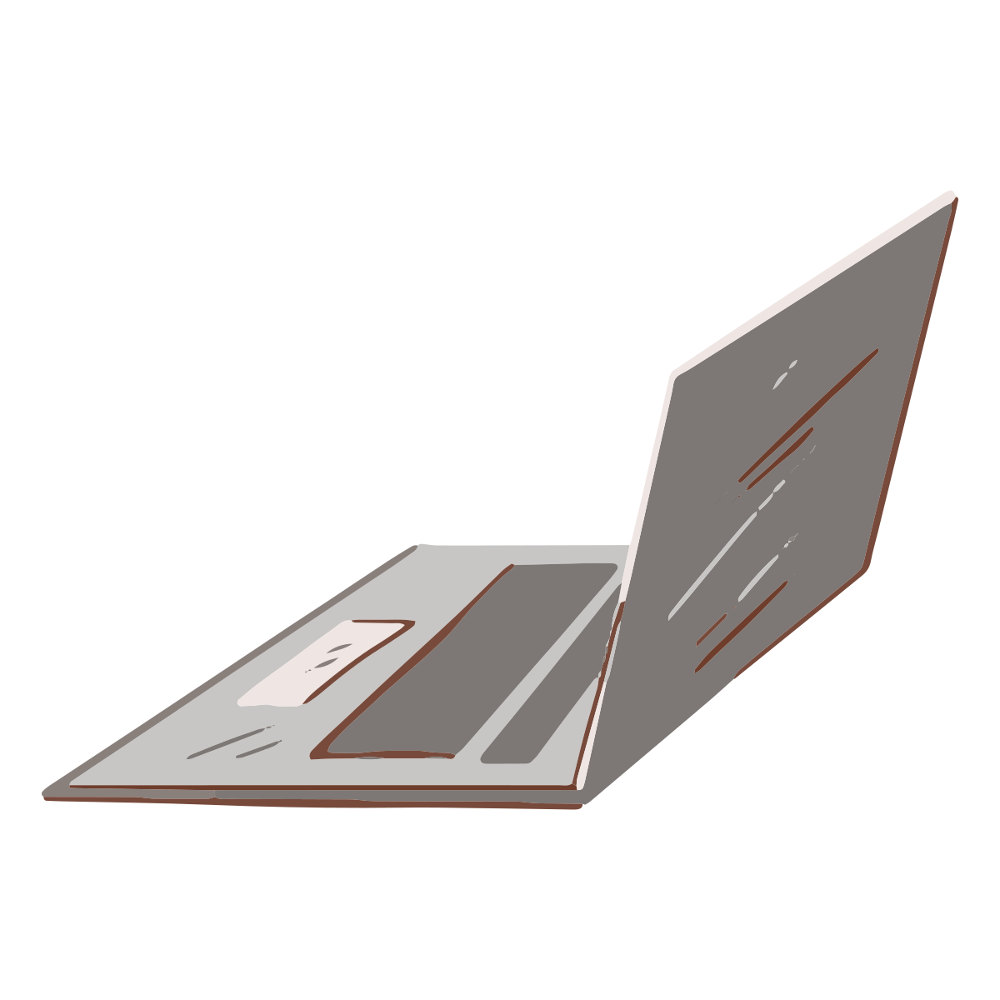
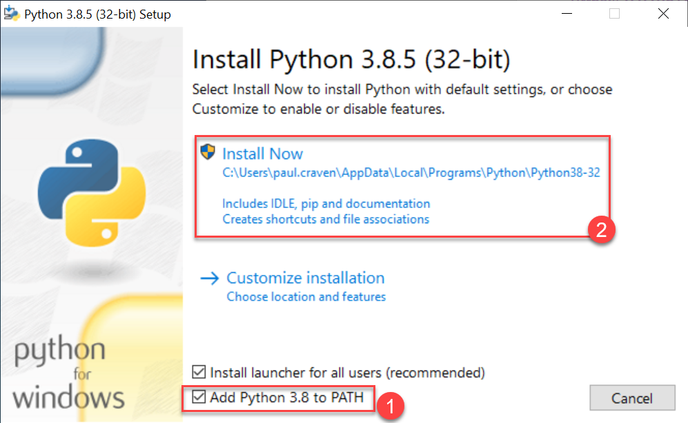

Configuración
======================

Configurar un sistema y prepararlo para programar puede ser un poco frustrante. 
No te rindas. Una vez que tengas un sistema configurado para programar, 
no necesitas pensar en ello nuevamente. 

Puedes concentrarte en la parte de programación. Es normal quedarse atascado 
durante la configuración, así que no dudes en pedir ayuda.

Computadora
------------------

   
Antes de comenzar a programar, necesitamos instalar algunas cosas. 
¿Usas una computadora en tu casa o en el colegio? ¡Genial! Es posible que 
ya tengas todo esto instalado. De todos modos, lee esta parte, ya que es posible 
que necesites configurar tu propio sistema en el futuro.

¿Qué necesitas?

#. Instalar un :term:`IDE` para escribir tus programas. (Usaremos un programa llamado Visual Studio Code. 
#. Instalar el :term:`lenguaje de programación` Python.
.. #. Un pequeño ajuste de configuración para que podamos ver las extensiones de archivo.

Visual Studio Code
------------------

Necesitamos un editor. Python viene con un editor llamado IDLE, pero es horrible 
y no vale la pena usarlo. Usaremos un editor llamado **Visual Studio Code**.

.. figure:: img/vscode.png
   :width: 200
   :align: right 
   :alt: Visual Studio Code

Visual Studio Code es un programa poderoso que te permite hacer más que 
simplemente editar el programa, también incluye un gran conjunto de herramientas 
que los programadores necesitan. 

Este tipo de entorno se llama Entorno de Desarrollo Integrado, o IDE para abreviar.
Descarga e instala `Visual Studio Code <https://code.visualstudio.com/>`_.

Python 
------------------

Usaremos el lenguaje de programación de computadoras “Python” que puedes 
descargar del `sitio web oficial de Python <https://www.python.org/downloads/>`_.

Al instalar Python, asegúrate de agregar Python a la ruta (1) antes de 
hacer clic en el botón Instalar (2).

Arcade
------------------

#. Abre la terminal, como se muestra en la siguiente imagen:

    .. figure:: img/cmd.png
    :width: 400
    :figclass: align-center
    :alt: cmd

#. En la misma terminal, instale la biblioteca **Arcade** mediante el 
siguiente comando:

    .. attention::
        
        python -m pip install arcade

#. Al final, debe aparecer un mensaje como el siguiente

    .. figure:: img/installed.png
    :width: 400
    :figclass: align-center
    :alt: installed arcade

Puedes consultar la documentación de Arcade en el `sitio oficial <https://api.arcade.academy/en/latest/>`_