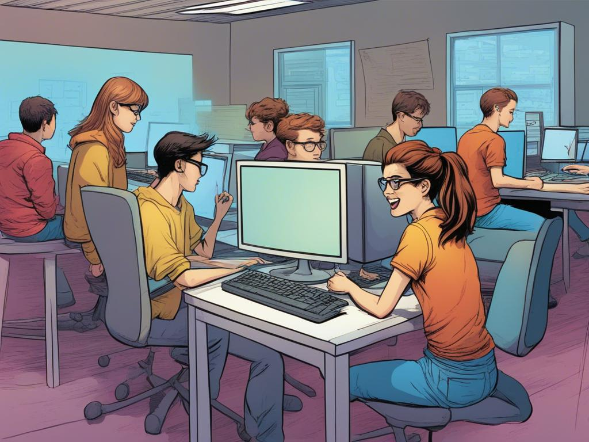

Programación con Python
===================================

Aprenderás a programar mientras das vida a tu videojuego, desde la idea inicial hasta los efectos de sonido y la música.

**¿Qué aprenderás?**

#. A usar variables y funciones como si fueran los ladrillos de tu juego,
#. A crear estructuras de control para que tu juego tenga lógica y los personajes se muevan como tú quieras.
#. A manejar eventos para que el juego responda a las acciones del jugador, ¡como si supiera lo que estás pensando!
#. A ponerle sonido y efectos para que tu juego sea una experiencia inmersiva y emocionante.

Contenido
--------

.. toctree::
  :numbered:
  :maxdepth: 1
  presentacion
