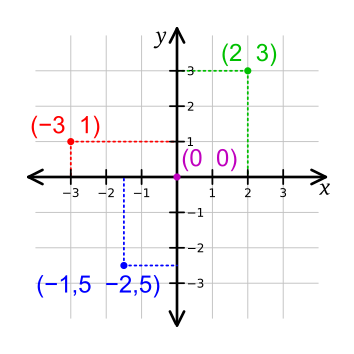
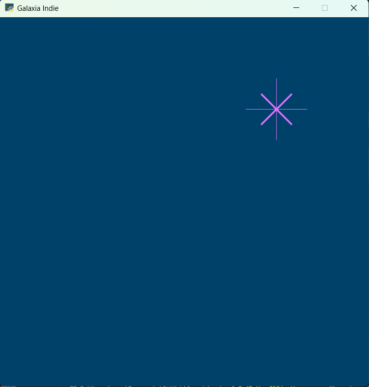
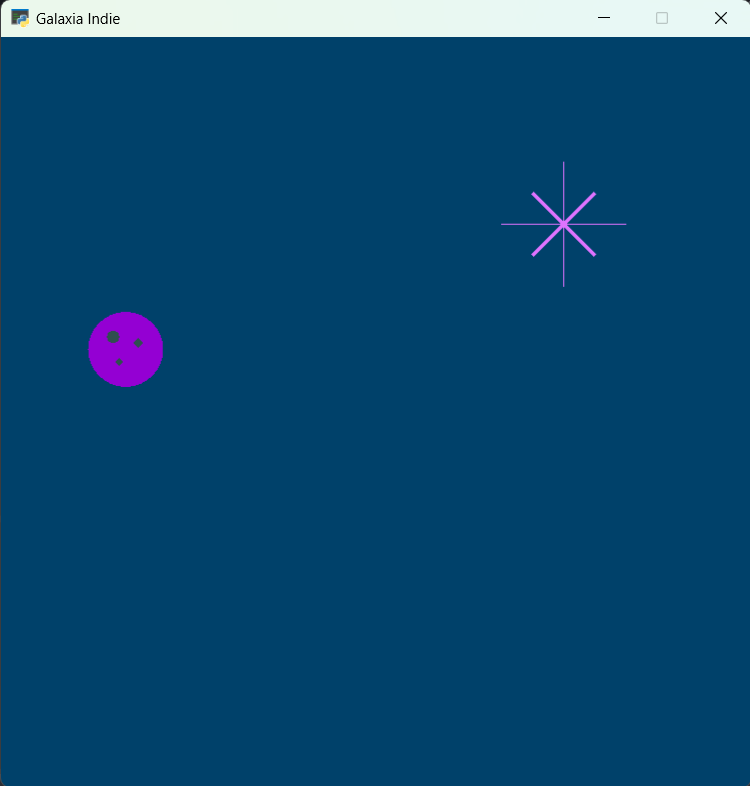

Estrellas✨ y Planetas🌑
===================================

Sistema de coordenadas
------------------

Hemos aprendido a especificar el color de lo que queremos dibujar, lo 
siguiente que necesitamos aprender es cómo ubicarlos. En tus clases 
de matemáticas, probablemente has aprendido sobre el sistema de 
coordenadas cartesiano, que se ve así:

Fuente: `Wikipedia: Cartesian coordinate system <https://commons.wikimedia.org/wiki/File:Cartesian_coordinate_system_(comma).svg>`_

Nuestros gráficos se dibujarán usando este mismo sistema. Pero 
debemos tener en cuenta:

1. Solo dibujaremos en el cuadrante superior derecho (Cuadrante I). 
Por lo tanto, el punto 0,0 estará en la esquina inferior izquierda 
de la pantalla, y todas las coordenadas negativas estarán fuera de 
la pantalla.

2. Cada punto es un :term:`píxel`. Así que tu ventana tiene 600 
píxeles de ancho. 

.. warning::

  Recuerda que los píxeles se cuentan desde el cero (0). El cero es uno 
  de los píxeles, por lo que van desde el 0 hasta el 599 (600) píxeles.

De líneas a estrellas
------------------

Para dibujar una línea, se utiliza con la función :py:func:`arcade.draw_line()` 
con los siguientes parámetros:

1. La coordenada del punto inicial (posición en X, posición en Y), 
2. La coordenada del punto final (posición en X, posición en Y),
3. El color de la línea, y
4. El ancho de la línea. 

En nuestra imagen de ejemplo, usaremos varias líneas para dibujar 
rayos de una estrella:

.. code-block:: python
    :emphasize-lines: 8-12, 14-17

    ...

    # Inicio del dibujo
    ...

    # (Aquí irá el código para dibujar)

    # Rayos de luz
    # Horizontal, de izquierda (400, 450) a derecha (500, 450)
    arcade.draw_line(400, 450, 500, 450, arcade.color.HELIOTROPE, 1)
    # Vertical, de arriba (450, 500) a abajo (450, 400)
    arcade.draw_line(450, 500, 450, 400, arcade.color.HELIOTROPE, 1)

    # Abajo a la izquierda (425, 425) hacia arriba la derecha (475, 475)
    arcade.draw_line(425, 425, 475, 475, arcade.color.HELIOTROPE, 3)
    # Arriba a la izquierda (425, 475) hacia abajo la derecha (475, 425)
    arcade.draw_line(425, 475, 475, 425, arcade.color.HELIOTROPE, 3)

    # Fin del dibujo
    ...

.. rubric:: Reto
  :heading-level: 2
  :class: mi-clase-css

Crea tu propia estrella dentro de la ventana, tomando como centro el 
punto (100,100). Decide y escoge el tamaño, el grosor y el color de 
las líneas de la estrella.

.. admonition:: Clic aquí para ver una pista
  :collapsible: closed

  A continuación un ejemplo de código para dibujar una estrella en 
  el punto (100,100)

  .. code-block:: python

    # Estrella en  (100,100)
    # Línea horizontal
    arcade.draw_line(75, 100, 125, 100, arcade.color.HELIOTROPE, 1)
    # Línea vertical
    arcade.draw_line(100, 75, 100, 125, arcade.color.HELIOTROPE, 1)

    # Líneas diagonales
    arcade.draw_line(85, 85, 115, 115, arcade.color.HELIOTROPE, 3)
    arcade.draw_line(85, 115, 115, 85, arcade.color.HELIOTROPE, 3)

De círculos a planetas
------------------

Para dibujar un círculo, se utiliza con la función 
:py:func:`arcade.draw_circle_filled()` con los siguientes parámetros:

1. La coordenada del centro (posición en X, posición en Y), 
2. El radio del círculo,
3. El color de la línea. 

En nuestra imagen de ejemplo, usaremos un círculo para dibujar un planeta:

.. code-block:: python
    :emphasize-lines: 6,7

    ...

    # Inicio del dibujo
    ...

    # Planeta	
    arcade.draw_circle_filled(100, 350, 30, arcade.csscolor.DARK_VIOLET)

    # Fin del dibujo
    ...

.. note::

    Puedes consultar los nombres en la 
    tabla de colores de 
    `arcade.csscolor <https://api.arcade.academy/en/latest/api_docs/arcade.csscolor.html>`_.
    para especificar colores por nombre (por 
    ejemplo `arcade.csscolor.DARK_VIOLET`), 

De círculos a cráteres
------------------

En nuestra imagen de ejemplo, usaremos varios círculos para dibujar los 
cráteres en el planeta al sobreponer círculos de diferentes formas y colores:

.. code-block:: python
    :emphasize-lines: 9-12

    ...

    # Inicio del dibujo
    ...

    # Planeta	
    arcade.draw_circle_filled(100, 350, 30, arcade.csscolor.DARK_VIOLET)

    # Cráteres del planeta
    arcade.draw_circle_filled(90, 360, 5, arcade.csscolor.DARK_SLATE_GRAY)
    arcade.draw_circle_filled(110, 355, 4, arcade.csscolor.DARK_SLATE_GRAY)
    arcade.draw_circle_filled(95, 340, 3, arcade.csscolor.DARK_SLATE_GRAY)

    # Fin del dibujo
    ...

.. rubric:: Reto
  :heading-level: 2
  :class: mi-clase-css

Crea tu propio planeta dentro de la ventana, tomando como centro el
punto (200,200). Decide la cantidad y el color de los crácteres en el planeta.

.. admonition:: Clic aquí para ver una pista
  :collapsible: closed

  A continuación un ejemplo de código para dibujar un planeta en el 
  punto (200,200)

  .. code-block:: python

    # Planeta en (200,200)
    # Planeta Gris
    arcade.draw_circle_filled(200, 200, 15, arcade.csscolor.GRAY)
    
    # Cráteres del planeta
    arcade.draw_circle_filled(190, 205, 3, arcade.csscolor.DARK_GRAY)
    arcade.draw_circle_filled(210, 195, 3, arcade.csscolor.DARK_GRAY)
    arcade.draw_circle_filled(205, 210, 2, arcade.csscolor.DARK_GRAY)

Texto
------------------

Para dibujar texto, se utiliza con la función :py:func:`arcade.draw_text()` 
con los siguientes parámetros:

1. El texto a dibujar,
2. La coordenada del punto inicial (posición en X, posición en Y),
3. El color del texto,
4. El tamaño del texto.

.. code-block:: python
    :emphasize-lines: 9-10

    ...

    # Inicio del dibujo
    ...

    # Cráteres del planeta
    ...

    # Título en (300, 200), de tamaño 32 pts.
    arcade.draw_text("Galaxia Indie", 300, 200, arcade.color.WHEAT, 32)

    # Fin del dibujo
    ...

.. image:: ../img/sesion02/texto.png
  :width: 300
  :alt: texto

Hasta ahora, hemos aprendido cómo importar **Arcade** y cómo llamar a ciertas 
funciones para dibujar figuras geométricas. El siguiente paso es hacer nuestro 
código más flexible.

Constantes
------------------

Una :term:`constante` es un valor que no cambia durante la ejecución del 
programa, por ejemplo el ancho de la ventana.

.. code-block:: python
    :emphasize-lines: 3,6

    ...

    ANCHO = 600

    # Crear una ventana de 600x600 píxeles con el título "Misión 01: Listos para el despegue"
    arcade.open_window( ANCHO, 600, "Misión 01: Listos para el despegue")    

    ...

El código anterior, se asigna el valor de 600 la constante ``ANCHO``. 
Luego, en la función :py:func:`arcade.open_window()` reemplace el valor de 600 
por el nombre de la constante ``ANCHO``.

.. warning::
    
    1. Los nombres deben ser descriptivos, 
    2. Todas las letras en **mayúscula**, 
    3. Si tienes varias palabras, sepáralas con un guión bajo, y 
    4. Los nombres no pueden  comenzar con un número ni tener un espacio ni ningún símbolo que no sea un guión bajo. 

.. rubric:: Reto
  :heading-level: 2
  :class: mi-clase-css

Crea las constantes ``ALTO`` y ``TITULO``. Asigna a cada constan el valor 
correspondiente. Luego, en la función :py:func:`arcade.open_window()` reemplace 
los valores por la constante correspondiente.

.. admonition:: Clic aquí para ver una pista
  :collapsible: closed

  A continuación, la solución al reto anterior.

  .. code-block:: python
    :emphasize-lines: 4,5,8

    ...

    ANCHO = 600
    ALTO = 600
    TITULO = "Misión 01: Listos para el despegue"
    
    # Crear una ventana de 600x600 píxeles con el título "Misión 01: Listos para el despegue"
    arcade.open_window( ANCHO, ALTO, TITULO )    

    ...

Variables
------------------

Una :term:`variable` es un valor que la computadora almacena en la memoria y 
que puede cambiar (variar) en otra parte del programa. 

A continuación, agrega las siguientes instrucciones al código anterior:

  .. code-block:: python
    :emphasize-lines: 1

    ...

    # (Aquí irá el código para dibujar)
    

    ...

Para identificar las variables y las constantes, hay nombres que debes usar, 
nombres que no debes usar y nombres que no puedes usar.

.. warning::
    
    1. Los nombres deben ser descriptivos, 
    2. Todas las letras en **minúscula**, 
    3. Si tienes varias palabras, sepáralas con un guión bajo, y 
    4. Los nombres no pueden  comenzar con un número ni tener un espacio ni ningún símbolo que no sea un guión bajo. 
