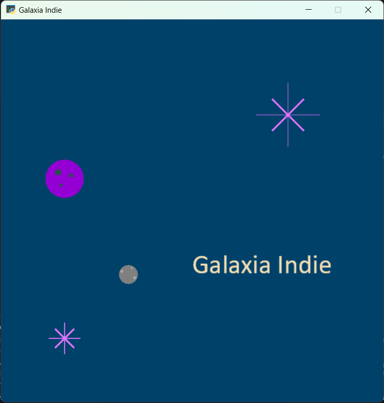

Misión 03: Galaxias 🌌
===================================

En la misión anterior aprendimos a usar instrucciones, crear variables y a crear en expresiones matemáticas. 

En esta misión, aprenderemos a crear nuestras propias :term:`funciones` para dar un instrucciones a la computadora.

Ya hemos usado funciones, por ejemplo, la función :py:func:`arcade.draw_line()` o la función :py:func:`arcade.Text()`. Ahora vamos a aprender a crear nuestras propias funciones.

.. rubric:: En resumen
  :heading-level: 2

Utiliza, o crea, el archivo **intro.py** con el siguiente código:

.. code-block:: python

  """
  Galaxia Indie

  Un juego indie minimalista de exploración espacial
  donde viajarás a través del cosmos.
  Navega a través de misteriosos sistemas estelares,
  descubriendo antiguos artefactos y desentrañando los
  misterios de una civilización olvidada.

  Creado con Python y con Arcade.
  """

  # Importar la librería "arcade" para crear videojuegos.
  import arcade

  # Constantes
  ANCHO = 600
  ALTO = 600
  TITULO = "Galaxia Indie"

  # Variables
  planeta_centro_x = 200
  planeta_centro_y = 200
  radio = 15

  crater1_centro_x = planeta_centro_x - 10
  crater1_centro_y = planeta_centro_y + 5
  crater2_centro_x = planeta_centro_x + 10
  crater2_centro_y = planeta_centro_y - 5
  crater3_centro_x = planeta_centro_x + 5
  crater3_centro_y = planeta_centro_y + 10

  # Crear una ventana de 600x600 píxeles con el título "Galaxia Indie"
  arcade.open_window( ANCHO, ALTO, TITULO )

  # Establecer el color de fondo de la ventana
  arcade.set_background_color( arcade.color.DARK_IMPERIAL_BLUE )

  # Inicio del dibujo
  arcade.start_render()

  # (Aquí irá el código para dibujar)

  # Rayos de luz
  # Horizontal, de izquierda (400, 450) a derecha (500, 450)
  arcade.draw_line(400, 450, 500, 450, arcade.color.HELIOTROPE, 1)
  # Vertical, de arriba (450, 500) a abajo (450, 400)
  arcade.draw_line(450, 500, 450, 400, arcade.color.HELIOTROPE, 1)

  # Abajo a la izquierda (425, 425) hacia arriba la derecha (475, 475)
  arcade.draw_line(425, 425, 475, 475, arcade.color.HELIOTROPE, 3)
  # Arriba a la izquierda (425, 475) hacia abajo la derecha (475, 425)
  arcade.draw_line(425, 475, 475, 425, arcade.color.HELIOTROPE, 3)

  # Estrella en  (100,100)
  # Línea horizontal
  arcade.draw_line(75, 100, 125, 100, arcade.color.HELIOTROPE, 1)
  # Línea vertical
  arcade.draw_line(100, 75, 100, 125, arcade.color.HELIOTROPE, 1)

  # Líneas diagonales
  arcade.draw_line(85, 85, 115, 115, arcade.color.HELIOTROPE, 3)
  arcade.draw_line(85, 115, 115, 85, arcade.color.HELIOTROPE, 3)

  # Planeta
  arcade.draw_circle_filled(100, 350, 30, arcade.csscolor.DARK_VIOLET)

  # Cráteres del planeta
  arcade.draw_circle_filled(90, 360, 5, arcade.csscolor.DARK_SLATE_GRAY)
  arcade.draw_circle_filled(110, 355, 4, arcade.csscolor.DARK_SLATE_GRAY)
  arcade.draw_circle_filled(95, 340, 3, arcade.csscolor.DARK_SLATE_GRAY)

  # Planeta en (200,200)
  # Planeta Gris
  arcade.draw_circle_filled( planeta_centro_x, planeta_centro_y, radio, arcade.csscolor.GRAY)

  # Cráteres del planeta
  arcade.draw_circle_filled(crater1_centro_x, crater1_centro_y, 3, arcade.csscolor.DARK_GRAY)
  arcade.draw_circle_filled(crater2_centro_x, crater2_centro_y, 3, arcade.csscolor.DARK_GRAY)
  arcade.draw_circle_filled(crater3_centro_x, crater3_centro_y, 2, arcade.csscolor.DARK_GRAY)

  # Título en (300, 200), de tamaño 32 pts.
  arcade.Text("Galaxia Indie", 300, 200, arcade.color.WHEAT, 32).draw()

  # Fin del dibujo
  arcade.finish_render()

  # Inicia el bucle principal del juego que mantiene la ventana abierta
  arcade.run()

Función: Título del juego
------------------

.. code-block:: python
   :caption: Función titulo_juego

    def titulo_juego():
        """ Esta función muestra el título del juego. """

        # Aquí va una línea de código
        # Aquí va otra línea de código 
        
Reglas para escribir una función:

#. Comienza con la palabra clave ``def``, que es la abreviatura de *define*.
#. A continuación, escribe el nombre de la función. 
#. Después de eso, tenemos un par de paréntesis. Dentro de los paréntesis irán los :term:`parámetros` (Los veremos después).
#. A continuación, dos puntos.
#. Por lo general, comenzamos una función con un comentario de varias líneas que explica lo que hace la función.
#. Todo el código dentro función tiene :term:`sangría` o :term:`indentación`. 

.. warning::
    El nombre de una función sigue las mismas reglas que los nombres de variables. Deben:

        1. Comenzar con una letra minúscula.
        2. Después de la primera letra, solo usa letras, números y guiones bajos.
        3. No se permiten espacios. Usa guiones bajos en su lugar.
        4. Si bien se pueden usar letras mayúsculas, los nombres de las funciones normalmente son todos en minúsculas.

.. rubric:: 1. Identifica las instrucciones
  :heading-level: 2

**Identifica** la instrucción que colocaremos en la función :py:func:`titulo_juego()`:

.. code-block:: python
   :caption: Función titulo_juego
   :emphasize-lines: 5

    # Cráteres del planeta
    ...

    # Título en (300, 200), de tamaño 32 pts.
    arcade.Text("Galaxia Indie", 300, 200, arcade.color.WHEAT, 32).draw()

    # Fin del dibujo
    ...

.. rubric:: 2. Crea la función
  :heading-level: 2

Para **crear** la función en tu programa:

#. Ve al inicio del programa, después de la sección de variables.
#. Define la función :py:func:`titulo_juego()`. 
#. Coloca el código dentro de la función con la indentación.

.. code-block:: python
   :caption: Función titulo_juego
   :emphasize-lines: 4-9

    #Variables
    ....

    #Funciones
    def titulo_juego():
        """ Esta función muestra el título del juego. """

        # Título en (300, 200), de tamaño 32 pts.
        arcade.Text("Galaxia Indie", 300, 200, arcade.color.WHEAT, 32).draw()

    # Crear una ventana de 600x600 píxeles con el título "Galaxia Indie"
    ...

.. rubric:: 3. Llama a la función
  :heading-level: 2

Coloca el nombre de la función junto a un par de paréntesis ``()`` en lugar de se encontraban las instrucciones para **llamar** a la función.

.. code-block:: python
   :caption: Llamada a la función titulo_juego
   :emphasize-lines: 4

   ...
   
   # Título en (300, 200), de tamaño 32 pts.
   titulo_juego()

   # Fin del dibujo
   ...

Función: Dibujar las estrellas
------------------

.. rubric:: 1. Identifica las instrucciones
  :heading-level: 2

Recorta todas las instrucciones para crear las estrellas.

.. code-block:: python
   :caption: Recorta las instrucciones en tu programa

    ...
    # (Aquí irá el código para dibujar)

    # Rayos de luz
    # Horizontal, de izquierda (400, 450) a derecha (500, 450)
    arcade.draw_line(400, 450, 500, 450, arcade.color.HELIOTROPE, 1)
    # Vertical, de arriba (450, 500) a abajo (450, 400)
    arcade.draw_line(450, 500, 450, 400, arcade.color.HELIOTROPE, 1)

    # Abajo a la izquierda (425, 425) hacia arriba la derecha (475, 475)
    arcade.draw_line(425, 425, 475, 475, arcade.color.HELIOTROPE, 3)
    # Arriba a la izquierda (425, 475) hacia abajo la derecha (475, 425)
    arcade.draw_line(425, 475, 475, 425, arcade.color.HELIOTROPE, 3)

    # Estrella en  (100,100)
    # Línea horizontal
    arcade.draw_line(75, 100, 125, 100, arcade.color.HELIOTROPE, 1)
    # Línea vertical
    arcade.draw_line(100, 75, 100, 125, arcade.color.HELIOTROPE, 1)

    # Líneas diagonales
    arcade.draw_line(85, 85, 115, 115, arcade.color.HELIOTROPE, 3)
    arcade.draw_line(85, 115, 115, 85, arcade.color.HELIOTROPE, 3)

    # Planeta
    ...

.. rubric:: 2. Crea la función
  :heading-level: 2

Escribe la función :py:func:`dibujar_estrellas()`. Pega el código anterior dentro de la función. Asegúrate que todo el código tenga la misma indentación. 
 
.. code-block:: python
   :caption: Función dibujar_estrellas

    # Funciones
    def titulo_juego():
        ...
    
    def dibujar_estrellas():
    
        """ Esta función dibuja una estrella en la pantalla. """

        # Rayos de luz
        # Horizontal, de izquierda (400, 450) a derecha (500, 450)
        arcade.draw_line(400, 450, 500, 450, arcade.color.HELIOTROPE, 1)
        # Vertical, de arriba (450, 500) a abajo (450, 400)
        arcade.draw_line(450, 500, 450, 400, arcade.color.HELIOTROPE, 1)

        # Abajo a la izquierda (425, 425) hacia arriba la derecha (475, 475)
        arcade.draw_line(425, 425, 475, 475, arcade.color.HELIOTROPE, 3)
        # Arriba a la izquierda (425, 475) hacia abajo la derecha (475, 425)
        arcade.draw_line(425, 475, 475, 425, arcade.color.HELIOTROPE, 3)

        # Estrella en  (100,100)
        # Línea horizontal
        arcade.draw_line(75, 100, 125, 100, arcade.color.HELIOTROPE, 1)
        # Línea vertical
        arcade.draw_line(100, 75, 100, 125, arcade.color.HELIOTROPE, 1)

        # Líneas diagonales
        arcade.draw_line(85, 85, 115, 115, arcade.color.HELIOTROPE, 3)
        arcade.draw_line(85, 115, 115, 85, arcade.color.HELIOTROPE, 3)

    # Crear una ventana de 600x600 píxeles con el título "Galaxia Indie"
    ...

.. warning::

    Utiliza la tecla **TAB** para indentar el código. 

    .. figure:: ../img/sesion03/tab.jpg
      :width: 200
      :figclass: align-center
      :alt: Tecla TAB

.. rubric:: 3. Llama a la función
  :heading-level: 2

Llama a la función :py:func:`dibujar_estrellas()` en lugar donde se encontraban las instrucciones anteriores.

.. code-block:: python

    # (Aquí irá el código para dibujar)

    dibujar_estrellas()

    # Planeta
    ...

Función: Dibujar los planetas
------------------

#. Ahora, **identifica** las instrucciones para dibujar los planetas.
#. **Crea** la función al inicio del programa y pega el código dentro de la función.
#. **Llama** a la función en lugar donde se encontraban las instrucciones anteriores.

Galaxia
------------------

Ahora, tu código contendrá las funciones :py:func:`titulo_juego()`, :py:func:`dibujar_estrellas()` y :py:func:`dibujar_planetas()`. Además de la llamada a las funciones en lugar de las instrucciones.

.. code-block:: python

    #Funciones
    def titulo_juego():
        ...

    def dibujar_estrellas():
       ...

    def dibujar_planetas():
      ...

    ...
    # (Aquí irá el código para dibujar)

    dibujar_estrellas()
    dibujar_planetas()
    titulo_juego()

    # Fin del dibujo
    ...

Y tu programa se seguirá viendo de la misma manera:

.. rubric:: En resumen
  :heading-level: 2

Al finalizar esta sesión, tu código debería verse así:

.. code-block:: python

  """
  Galaxia Indie

  Un juego indie minimalista de exploración espacial
  donde viajarás a través del cosmos.
  Navega a través de misteriosos sistemas estelares,
  descubriendo antiguos artefactos y desentrañando los
  misterios de una civilización olvidada.

  Creado con Python y con Arcade.
  """

  # Importar la librería "arcade" para crear videojuegos.
  import arcade

  # Constantes
  ANCHO = 600
  ALTO = 600
  TITULO = "Galaxia Indie"

  # Variables
  planeta_centro_x = 200
  planeta_centro_y = 200
  radio = 15

  crater1_centro_x = planeta_centro_x - 10
  crater1_centro_y = planeta_centro_y + 5
  crater2_centro_x = planeta_centro_x + 10
  crater2_centro_y = planeta_centro_y - 5
  crater3_centro_x = planeta_centro_x + 5
  crater3_centro_y = planeta_centro_y + 10

  #Funciones
  def titulo_juego():
      """ Esta función muestra el título del juego. """

      # Título en (300, 200), de tamaño 32 pts.
      arcade.Text("Galaxia Indie", 300, 200, arcade.color.WHEAT, 32).draw()
      
  def dibujar_estrellas():

      """ Esta función dibuja una estrella en la pantalla. """

      # Rayos de luz
      # Horizontal, de izquierda (400, 450) a derecha (500, 450)
      arcade.draw_line(400, 450, 500, 450, arcade.color.HELIOTROPE, 1)
      # Vertical, de arriba (450, 500) a abajo (450, 400)
      arcade.draw_line(450, 500, 450, 400, arcade.color.HELIOTROPE, 1)

      # Abajo a la izquierda (425, 425) hacia arriba la derecha (475, 475)
      arcade.draw_line(425, 425, 475, 475, arcade.color.HELIOTROPE, 3)
      # Arriba a la izquierda (425, 475) hacia abajo la derecha (475, 425)
      arcade.draw_line(425, 475, 475, 425, arcade.color.HELIOTROPE, 3)

      # Estrella en  (100,100)
      # Línea horizontal
      arcade.draw_line(75, 100, 125, 100, arcade.color.HELIOTROPE, 1)
      # Línea vertical
      arcade.draw_line(100, 75, 100, 125, arcade.color.HELIOTROPE, 1)

      # Líneas diagonales
      arcade.draw_line(85, 85, 115, 115, arcade.color.HELIOTROPE, 3)
      arcade.draw_line(85, 115, 115, 85, arcade.color.HELIOTROPE, 3)
      
  def dibujar_planetas():
      
      # Planeta
      arcade.draw_circle_filled(100, 350, 30, arcade.csscolor.DARK_VIOLET)

      # Cráteres del planeta
      arcade.draw_circle_filled(90, 360, 5, arcade.csscolor.DARK_SLATE_GRAY)
      arcade.draw_circle_filled(110, 355, 4, arcade.csscolor.DARK_SLATE_GRAY)
      arcade.draw_circle_filled(95, 340, 3, arcade.csscolor.DARK_SLATE_GRAY)

      # Planeta en (200,200)
      # Planeta Gris
      arcade.draw_circle_filled( planeta_centro_x, planeta_centro_y, radio, arcade.csscolor.GRAY)

      # Cráteres del planeta
      arcade.draw_circle_filled(crater1_centro_x, crater1_centro_y, 3, arcade.csscolor.DARK_GRAY)
      arcade.draw_circle_filled(crater2_centro_x, crater2_centro_y, 3, arcade.csscolor.DARK_GRAY)
      arcade.draw_circle_filled(crater3_centro_x, crater3_centro_y, 2, arcade.csscolor.DARK_GRAY)
      

  # Crear una ventana de 600x600 píxeles con el título "Galaxia Indie"
  arcade.open_window( ANCHO, ALTO, TITULO )

  # Establecer el color de fondo de la ventana
  arcade.set_background_color( arcade.color.DARK_IMPERIAL_BLUE )

  # Inicio del dibujo
  arcade.start_render()

  # (Aquí irá el código para dibujar)

  dibujar_estrellas()

  dibujar_planetas()

  # Título en (300, 200), de tamaño 32 pts.
  titulo_juego()

  # Fin del dibujo
  arcade.finish_render()

  # Inicia el bucle principal del juego que mantiene la ventana abierta
  arcade.run()