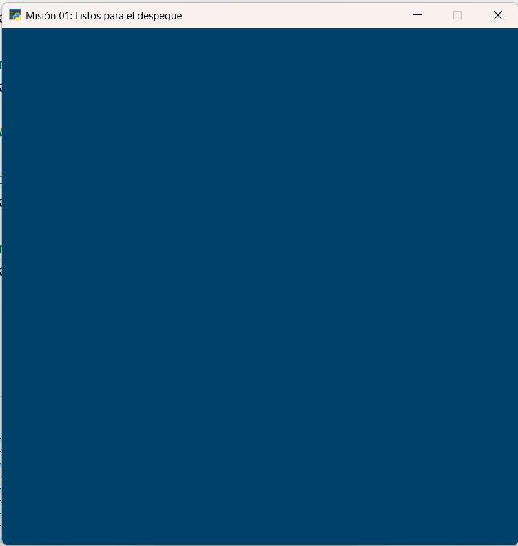
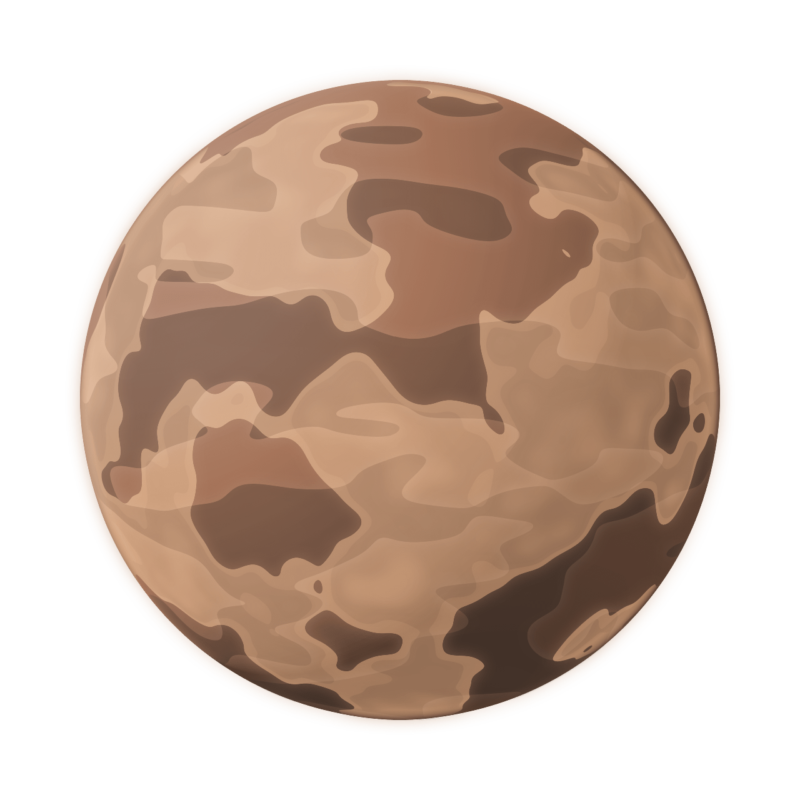
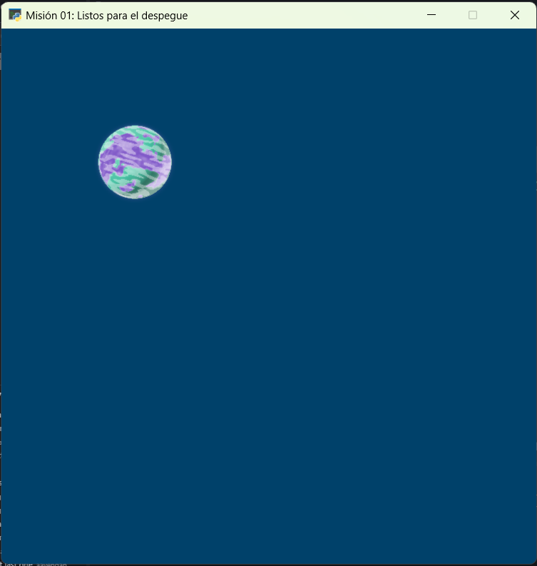
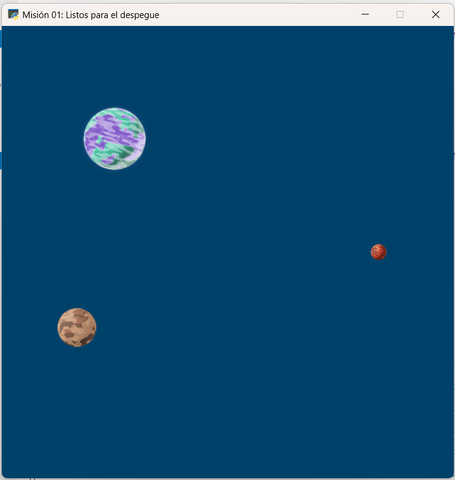

Misión 01: Despegue 🚀
===================================

Programa principal: mision01.py
------------------

En Visual Studio Code, crea el archivo ``mision01.py`` con el siguiente 
código básico:

.. code-block:: python

    """
    Galaxia Indie

    Un juego indie minimalista de exploración espacial 
    donde viajarás a través del cosmos.
    Navega a través de misteriosos sistemas estelares,
    descubriendo antiguos artefactos y desentrañando los 
    misterios de una civilización olvidada.

    Creado con Python y con Arcade.
    """

    # Importar la librería "arcade" para crear videojuegos.
    import arcade

    # Crear una ventana de 600x600 píxeles con el título "Misión 01: Listos para el despegue"
    ALTO = 600
    ANCHO = 600
    TITULO = "Misión 01: Listos para el despegue"
    arcade.open_window(ANCHO, ALTO, TITULO)    

    # Establecer el color de fondo de la ventana
    arcade.set_background_color( arcade.color.DARK_IMPERIAL_BLUE )

    # Inicio del dibujo
    arcade.start_render()

    # (Aquí irá el código para dibujar)

    # Fin del dibujo
    arcade.finish_render()

    # Inicia el bucle principal del juego que mantiene la ventana abierta
    arcade.run()

Ejecuta el código y verás una ventana con el color de fondo azul oscuro, como 
se muestra en la siguente imagen. 

Configuración
------------------

#. Para empezar, crea la carpeta `sprites` en tu proyecto.
#. Descarga las siguientes imágenes y colócalas en la carpeta `sprites`. 

.. figure:: ../img/sesion03/planeta01.png
   :scale: 10%
   :figwidth: 30%
   :alt: Planeta01

   sprites/planeta01.png

.. figure:: ../img/sesion03/planeta02.png
   :scale: 10%
   :figwidth: 30%
   :alt: Planeta02

   sprites/planeta02.png

   sprites/planeta03.png

.. note::
    
    Puedes obtener más imágenes en `kenney.nl <https://kenney.nl/>`_.

Sprite y SpriteList
------------------

Un :term:`sprite` es una imagen :term:`bidimensional` que forma 
parte de una escena gráfica más grande. Por lo general, un sprite 
será algún tipo de objeto en la escena con el que se interactuará, 
como un planeta, un extraterrestre o una nave.

Copia el siguiente código y colócalo en la ubicación indicada.

.. code-block:: python
    :emphasize-lines: 5-6, 8-11, 13-14, 16-17

    ...

    # (Aquí irá el código para dibujar)

    # Creamos una lista de sprites
    planetas = arcade.SpriteList()

    # Creamos un sprite y establecemos la posición
    planeta1 = arcade.Sprite("sprites/planeta01.png", 0.08)
    planeta1.center_x = 150
    planeta1.center_y = 450

    # Agregamos el sprite a la lista de sprites
    planetas.append(planeta1)

    # Dibujamos la lista de sprites
    planetas.draw()

    # Fin del dibujo
    ...

Antes de empezar, utilizaremos la variable ``planetas`` 
para almacenar nuestros sprites en una :term:`lista` 
(:py:func:`arcade.SpriteList()`).

.. code-block:: python

    ...
    # Creamos una lista de sprites
    planetas = arcade.SpriteList()

Luego, usamos la variable ``planeta1`` 
para almacenar un sprite :py:func:`arcade.Sprite()`, 
con la :term:`ruta` a la imagen y la :term:`escala`. 

Además, usamos la variable ``planeta1`` para 
colocar el sprite en la ventana cuyo centro es (``x``, ``y``), con 
``planeta1.center_x = 150`` y en ``planeta1.center_y = 450``.

.. code-block:: python

    ...
    # Creamos un sprite y establecemos la posición
    planeta1 = arcade.Sprite("sprites/planeta01.png", 0.08)
    planeta1.center_x = 150
    planeta1.center_y = 450

Luego, con :py:func:`planetas.append()` agregamos el sprite 
(``planeta1``) a la lista de sprites (``planetas``).

.. code-block:: python

    ...
    # Agregamos el sprite a la lista de sprites
    planetas.append(planeta1)

Finalmente, dibujamos la lista de sprites ``planetas`` en la ventana.

.. code-block:: python

    ...
    # Dibujamos la lista de sprites
    planetas.draw()

.. rubric:: Reto
  :heading-level: 2
  :class: mi-clase-css

#. Crea un sprite para la imagen ``sprites/planeta02.png``, con una escala de **0.02**. El centro se encuentra a **100 píxeles** menos del ancho de la ventana y a la **mitad vertical** de la ventana.
#. Crea un sprite para la imagen ``sprites/planeta03.png``, con una escala de **0.05**. El centro se encuentra a **100 píxeles** respecto con el borde izquierdo y a un **tercio de la vertical** de la ventana.
#. Agrega cada uno de los sprites a la lista de sprites.

Al ejecutar el código, deberías ver los tres planetas en la ventana como 
se muestra a continuación.

.. admonition:: Haga click aquí para ver la solución
  :collapsible: closed

  .. code-block:: python
    :emphasize-lines: 4-8,10-14

    ...
    planetas.append(planeta1)

    # Sprite 2
    planeta2 = arcade.Sprite("sprites/planeta02.png", 0.02)
    planeta2.center_x = ANCHO - 100 
    planeta2.center_y = ALTO / 2
    planetas.append(planeta2)

    # Sprite 3
    planeta3 = arcade.Sprite("sprites/planeta03.png", 0.05)
    planeta3.center_x = 100
    planeta3.center_y = ALTO / 3
    planetas.append(planeta3)

    planetas.draw()

