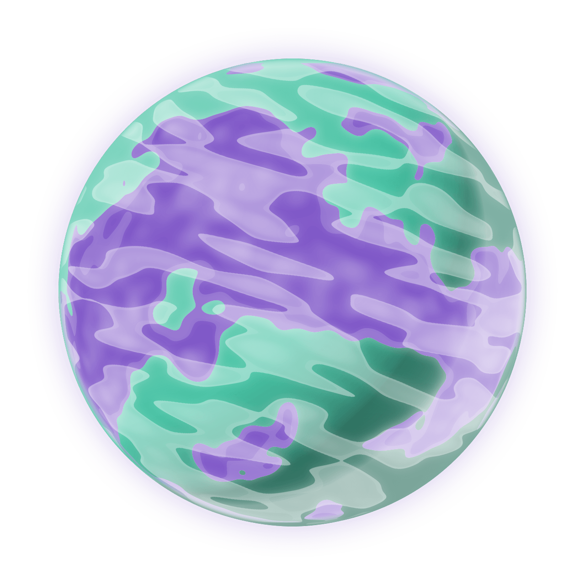

Misión 01: Despegue 🚀
===================================

Programa principal: mision01.py
------------------

En Visual Studio Code, crea el archivo ``mision01.py`` con el siguiente 
código básico:

.. code-block:: python

    """
    Galaxia Indie

    Un juego indie minimalista de exploración espacial 
    donde viajarás a través del cosmos.
    Navega a través de misteriosos sistemas estelares,
    descubriendo antiguos artefactos y desentrañando los 
    misterios de una civilización olvidada.

    Creado con Python y con Arcade.
    """

    # Importar la librería "arcade" para crear videojuegos.
    import arcade

    # Crear una ventana de 600x600 píxeles con el título "Misión 01: Listos para el despegue"
    ALTO = 600
    ANCHO = 600
    TITULO = "Misión 01: Listos para el despegue"
    arcade.open_window(ANCHO, ALTO, TITULO)    

    # Establecer el color de fondo de la ventana
    arcade.set_background_color( arcade.color.DARK_IMPERIAL_BLUE )

    # Inicio del dibujo
    arcade.start_render()

    # (Aquí irá el código para dibujar)

    # Fin del dibujo
    arcade.finish_render()

    # Inicia el bucle principal del juego que mantiene la ventana abierta
    arcade.run()

Ejecuta el código y verás una ventana con el color de fondo azul oscuro, como 
se muestra en la siguente imagen. 

.. imagen

Configuración
------------------

Para empezar, veamos descargar imágenes a utilizar, que son 
de `kenney.nl <https://kenney.nl/>`_.

   Descargar y guardar en sprites/planeta01.png

.. image:: ../img/sesion03/nave01.png
  :width: 80
  :alt: Nave

Personajes
------------------

Un :term:`sprite` es una imagen :term:`bidimensional` que forma 
parte de una escena gráfica más grande. Por lo general, un sprite 
será algún tipo de objeto en la escena con el que se interactuará, 
como un planeta, un extraterrestre o una nave.

  .. code-block:: python
    :emphasize-lines: 11-14

      ...

      # (Aquí irá el código para dibujar)
      planetas = arcade.SpriteList()

      planeta1 = arcade.Sprite("sprites/planet01.png", 0.08)
      planeta1.center_x = 150
      planeta1.center_y = 450
      planetas.append(planeta1)

      planetas.draw()