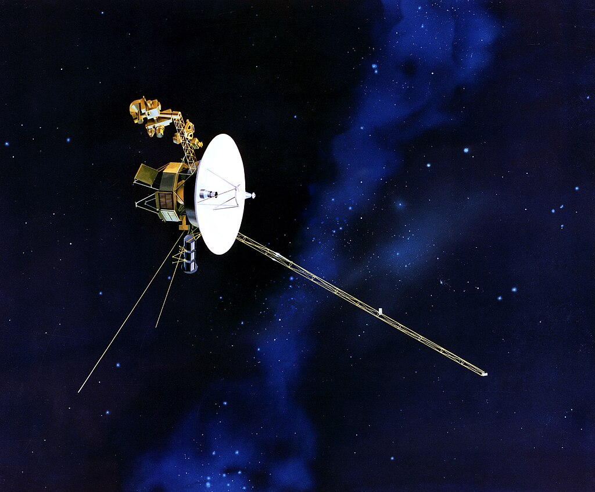
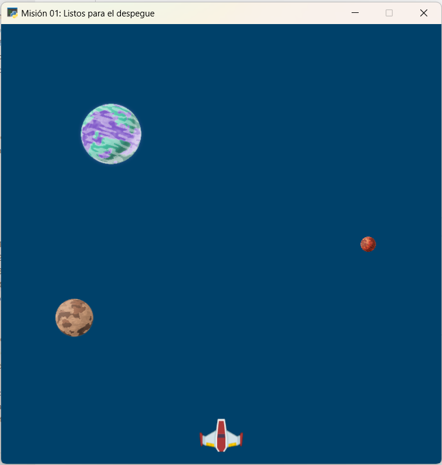

Misión 04: Sonda espacial 🛰️
===================================

En la misión anterior aprendimos a usar instrucciones, crear variables, a crear en expresiones matemáticas y a usar sprites. 

En esta misión, aprenderemos a crear nuestras propias :term:`funciones` para dar un instrucciones específicas a la computadora.

Ya hemos usado funciones, por ejemplo, la función :py:func:`arcade.draw_line()`, la función :py:func:`arcade.Text()` o la función :py:func:`arcade.Sprite()`. Ahora vamos a aprender a crear nuestras propias funciones.

Para comenzar, abra **Visual Studio Code** y utiliza la carpeta ``galaxia_indie``. Verifica el archivo ``mision01.py`` tenga el siguiente código:

.. code-block:: python

  """
  Galaxia Indie

  Un juego indie minimalista de exploración espacial
  donde viajarás a través del cosmos.
  Navega a través de misteriosos sistemas estelares,
  descubriendo antiguos artefactos y desentrañando los
  misterios de una civilización olvidada.

  Creado con Python y con Arcade.
  """

  # Importar la librería "arcade" para crear videojuegos.
  import arcade

  # Constantes
  ALTO = 600
  ANCHO = 600
  TITULO = "Misión 01: Listos para el despegue"

  # Variables
  # Creamos una lista de sprites
  planetas = arcade.SpriteList()
  naves = arcade.SpriteList()

  # Creamos un sprite y establecemos la posición
  planeta1 = arcade.Sprite("sprites/planeta01.png", 0.08)
  planeta1.center_x = 150
  planeta1.center_y = 450

  # Agregamos el sprite a la lista de sprites
  planetas.append(planeta1)

  # Sprite 2
  planeta2 = arcade.Sprite("sprites/planeta02.png", 0.02)
  planeta2.center_x = ANCHO - 100
  planeta2.center_y = ALTO / 2
  planetas.append(planeta2)

  # Sprite 3
  planeta3 = arcade.Sprite("sprites/planeta03.png", 0.05)
  planeta3.center_x = 100
  planeta3.center_y = ALTO / 3
  planetas.append(planeta3)

  # Sprite 4
  nave01 = arcade.Sprite("sprites/nave01.png", 0.6)
  nave01.center_x = ANCHO / 2
  nave01.center_y = 40
  naves.append(nave01)

  # Crear una ventana de 600x600 píxeles con el título "Misión 01: Listos para el despegue"
  arcade.open_window(ANCHO, ALTO, TITULO)

  # Establecer el color de fondo de la ventana
  arcade.set_background_color( arcade.color.DARK_IMPERIAL_BLUE )

  # Inicio del dibujo
  arcade.start_render()

  # (Aquí irá el código para dibujar)
  planetas.draw()
  naves.draw()

  # Fin del dibujo
  arcade.finish_render()

  # Inicia el bucle principal del juego que mantiene la ventana abierta
  arcade.run()

Al ejecutar el código, deberías ver los tres planetas y la nave en la ventana como 
se muestra a continuación.

Función: Crear ventana
------------------

.. rubric:: 1. Selecciona y recorta las instrucciones
  :heading-level: 2

**Selecciona y recorta** las siguientes instrucciones y comentarios:

.. code-block:: python
   :caption: Selecciona y recorta las instrucciones
   :emphasize-lines: 4-5, 7-8

    # Sprite 4
    ...

    # Crear una ventana de 600x600 píxeles con el título "Misión 01: Listos para el despegue"
    arcade.open_window(ANCHO, ALTO, TITULO)

    # Establecer el color de fondo de la ventana
    arcade.set_background_color( arcade.color.DARK_IMPERIAL_BLUE )

    # Inicio del dibujo
    ...

.. rubric:: 2. Escribe la función y coloca el código
  :heading-level: 2

#. Ve al inicio del programa, después de crear todas las variables y define la función :py:func:`crear_ventana()`. 
#. Pega las instrucciones y los comentarios que copiaste anteriormente.
#. Selecciona SOLO las instrucciones y los comentarios que pegaste recientemente, y presiona una (1) vez la tecla TAB.

.. code-block:: python
   :caption: Función titulo_juego
   :emphasize-lines: 4-12

    # Sprite 4
    ....

    #Funciones
    def crear_ventana():
      """ Esta función muestra la ventana. """

      # Crear una ventana de 600x600 píxeles con el título "Misión 01: Listos para el despegue"
      arcade.open_window(ANCHO, ALTO, TITULO)

      # Establecer el color de fondo de la ventana
      arcade.set_background_color( arcade.color.DARK_IMPERIAL_BLUE )

    # Inicio del dibujo
    ...

.. rubric:: 3. Llama a la función
  :heading-level: 2

Regresa al lugar donde se encontraban las instrucciones y **llama** a la función con su nombre y un par de paréntesis ``()``.

.. code-block:: python
   :caption: Llamada a la función crear_ventana
   :emphasize-lines: 7
  
   ...

   #Funciones
   def crear_ventana():
      ...
   
   crear_ventana()

   # Inicio del dibujo
   ...

Al ejecutar el código, deberías ver los tres planetas y la nave en la ventana como 
se muestra a continuación.

Reglas para escribir una función
------------------

Para escribir una función en Python, sigue estas reglas:

  #. Comienza con la palabra clave ``def``, que es la abreviatura de *define*.
  #. A continuación, escribe el nombre de la función. 
  #. Después del nombre de la función, tenemos un par de paréntesis. Dentro de los paréntesis irán los :term:`parámetros` (Los veremos después).
  #. A continuación, dos puntos.
  #. Por lo general, comenzamos una función con un comentario de varias líneas que explica lo que hace la función.
  #. Todo el código dentro función tiene :term:`sangría` o :term:`indentación`. 

.. warning::

  El nombre de una función sigue las mismas reglas que los nombres de variables. Deben:

    1. Comenzar con una letra minúscula.
    2. Después de la primera letra, solo usa letras, números y guiones bajos.
    3. No se permiten espacios. Usa guiones bajos en su lugar.
    4. Si bien se pueden usar letras mayúsculas, los nombres de las funciones normalmente son todos en minúsculas.

Función: Dibujar elementos
------------------

.. rubric:: Reto
  :heading-level: 2
  :class: mi-clase-css

#. Crea la función :py:func:`dibujar_elementos()`.
#. Copia y pega las instrucciones que dibujan la lista con los planetas y la nave.
#. Llama a la función :py:func:`dibujar_elementos()` en la parte del código donde se dibujan los elementos. 

Al ejecutar el código, deberías ver los tres planetas y la nave en la ventana como 
se muestra a continuación.

.. admonition:: Haga click aquí para ver la solución
  :collapsible: closed

  .. code-block:: python
    :emphasize-lines: 5-9, 15

    #Funciones
    def crear_ventana():
      ...

    def dibujar_elementos():
      """ Dibuja los elementos en pantalla """
      
      planetas.draw()
      naves.draw()

    # Inicio del dibujo
    ...

    # (Aquí irá el código para dibujar)
    dibujar_elementos()

    # Fin del dibujo
    ...

.. rubric:: En resumen
  :heading-level: 2

Al finalizar esta sesión, tu código debería verse así:

.. code-block:: python

  """
  Galaxia Indie

  Un juego indie minimalista de exploración espacial
  donde viajarás a través del cosmos.
  Navega a través de misteriosos sistemas estelares,
  descubriendo antiguos artefactos y desentrañando los
  misterios de una civilización olvidada.

  Creado con Python y con Arcade.
  """

  # Importar la librería "arcade" para crear videojuegos.
  import arcade

  # Constantes
  ALTO = 600
  ANCHO = 600
  TITULO = "Misión 01: Listos para el despegue"

  # Variables
  # Creamos una lista de sprites
  planetas = arcade.SpriteList()
  naves = arcade.SpriteList()

  # Creamos un sprite y establecemos la posición
  planeta1 = arcade.Sprite("sprites/planeta01.png", 0.08)
  planeta1.center_x = 150
  planeta1.center_y = 450

  # Agregamos el sprite a la lista de sprites
  planetas.append(planeta1)

  # Sprite 2
  planeta2 = arcade.Sprite("sprites/planeta02.png", 0.02)
  planeta2.center_x = ANCHO - 100
  planeta2.center_y = ALTO / 2
  planetas.append(planeta2)

  # Sprite 3
  planeta3 = arcade.Sprite("sprites/planeta03.png", 0.05)
  planeta3.center_x = 100
  planeta3.center_y = ALTO / 3
  planetas.append(planeta3)

  # Sprite 4
  nave01 = arcade.Sprite("sprites/nave01.png", 0.6)
  nave01.center_x = ANCHO / 2
  nave01.center_y = 40
  naves.append(nave01)

  #Funciones
  def crear_ventana():
    """ Esta función muestra la ventana. """

    # Crear una ventana de 600x600 píxeles con el título "Misión 01: Listos para el despegue"
    arcade.open_window(ANCHO, ALTO, TITULO)

    # Establecer el color de fondo de la ventana
    arcade.set_background_color( arcade.color.DARK_IMPERIAL_BLUE )
    
  def dibujar_elementos():
      """ Dibuja los elementos en pantalla """
      
      planetas.draw()
      naves.draw()

  crear_ventana()

  # Inicio del dibujo
  arcade.start_render()

  # (Aquí irá el código para dibujar)
  dibujar_elementos()

  # Fin del dibujo
  arcade.finish_render()

  # Inicia el bucle principal del juego que mantiene la ventana abierta
  arcade.run()