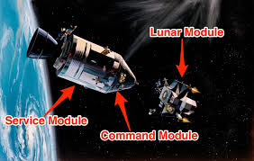

Misión 04: Módulo espacial 🛰️🚀
===================================

En la misión anterior aprendimos a usar instrucciones, crear variables, a crear en expresiones matemáticas y a usar sprites. 

En esta misión, aprenderemos a crear nuestras propias :term:`funciones` para con instrucciones únicas y específicas dentro de nuestro programa.

Antes, ya hemos usado funciones; por ejemplo, la función :py:func:`arcade.draw_line()`, la función :py:func:`arcade.Text()` o la función :py:func:`arcade.Sprite()`. Ahora vamos a aprender a crear nuestras propias funciones.

Para comenzar, abra **Visual Studio Code** y utiliza la carpeta ``galaxia_indie``. Verifica el archivo ``mision01.py`` tenga el siguiente código:

.. code-block:: python

  """
  Galaxia Indie

  Un juego indie minimalista de exploración espacial
  donde viajarás a través del cosmos.
  Navega a través de misteriosos sistemas estelares,
  descubriendo antiguos artefactos y desentrañando los
  misterios de una civilización olvidada.

  Creado con Python y con Arcade.
  """

  # Importar la librería "arcade" para crear videojuegos.
  import arcade

  # Constantes
  ALTO = 600
  ANCHO = 600
  TITULO = "Misión 01: Listos para el despegue"

  # Variables
  # Creamos una lista de sprites
  planetas = arcade.SpriteList()
  naves = arcade.SpriteList()

  # Creamos un sprite y establecemos la posición
  planeta1 = arcade.Sprite("sprites/planeta01.png", 0.08)
  planeta1.center_x = 150
  planeta1.center_y = 450

  # Agregamos el sprite a la lista de sprites
  planetas.append(planeta1)

  # Sprite 2
  planeta2 = arcade.Sprite("sprites/planeta02.png", 0.02)
  planeta2.center_x = ANCHO - 100
  planeta2.center_y = ALTO / 2
  planetas.append(planeta2)

  # Sprite 3
  planeta3 = arcade.Sprite("sprites/planeta03.png", 0.05)
  planeta3.center_x = 100
  planeta3.center_y = ALTO / 3
  planetas.append(planeta3)

  # Sprite 4
  nave01 = arcade.Sprite("sprites/nave01.png", 0.6)
  nave01.center_x = ANCHO / 2
  nave01.center_y = 40
  naves.append(nave01)

  # Crear una ventana de 600x600 píxeles con el título "Misión 01: Listos para el despegue"
  arcade.open_window(ANCHO, ALTO, TITULO)

  # Establecer el color de fondo de la ventana
  arcade.set_background_color( arcade.color.DARK_IMPERIAL_BLUE )

  # Inicio del dibujo
  arcade.start_render()

  # (Aquí irá el código para dibujar)
  planetas.draw()
  naves.draw()

  # Fin del dibujo
  arcade.finish_render()

  # Inicia el bucle principal del juego que mantiene la ventana abierta
  arcade.run()

Al ejecutar el código, deberías ver los tres planetas y la nave en la ventana como 
se muestra a continuación.

.. figure:: ../img/sesion04/tresplanetasynave.png
    :width: 300
    :figclass: align-center
    :alt: tresplanetasynave

Función: Crear ventana
------------------

.. rubric:: 1. Selecciona y recorta las instrucciones
  :heading-level: 2

**Selecciona y recorta** la siguiente instrucción y comentario:

.. code-block:: python
   :caption: Selecciona y recorta la siguiente instrucción y comentario
   :emphasize-lines: 4-5

    # Sprite 4
    ...

    # Crear una ventana de 600x600 píxeles con el título "Misión 01: Listos para el despegue"
    arcade.open_window(ANCHO, ALTO, TITULO)

    # Inicio del dibujo
    ...

.. rubric:: 2. Escribe la función y coloca el código
  :heading-level: 2

#. Ve al inicio del programa, después de crear todas las variables y define la función :py:func:`abrir_ventana()`. 
#. Pega las instrucciones y los comentarios que copiaste anteriormente.
#. Selecciona SOLO las instrucciones y los comentarios que pegaste recientemente, y presiona una (1) vez la tecla TAB.

.. code-block:: python
   :caption: Función abrir_ventana
   :emphasize-lines: 4-9

    # Sprite 4
    ....

    #Funciones
    def abrir_ventana():
      """ Abre la ventana """

      # Crear una ventana de 600x600 píxeles con el título "Misión 01: Listos para el despegue"
      arcade.open_window(ANCHO, ALTO, TITULO)

    # Establecer el color de fondo de la ventana
    
    ...

.. rubric:: 3. Llama a la función
  :heading-level: 2

Regresa al lugar donde se encontraban la instrucción y **llama** a la función con su nombre y un par de paréntesis ``()``.

.. code-block:: python
   :caption: Llamada a la función abrir_ventana
   :emphasize-lines: 7
  
   ...

   #Funciones
   def abrir_ventana():
      ...
   
   abrir_ventana()

   # Establecer el color de fondo de la ventana
   ...

Al ejecutar el código, deberías ver los tres planetas y la nave en la ventana como 
se muestra a continuación.

.. figure:: ../img/sesion04/tresplanetasynave.png
    :width: 300
    :figclass: align-center
    :alt: tresplanetasynave

Reglas para escribir una función
------------------

Para escribir una función en Python, sigue estas reglas:

  #. Comienza con la palabra clave ``def``, que es la abreviatura de *define*.
  #. A continuación, escribe el nombre de la función. 
  #. Después del nombre de la función, tenemos un par de paréntesis. Dentro de los paréntesis irán los :term:`parámetros` (Los veremos después).
  #. A continuación, dos puntos.
  #. Por lo general, comenzamos una función con un comentario de varias líneas que explica lo que hace la función.
  #. Todo el código dentro función tiene :term:`sangría` o :term:`indentación`. 

.. warning::

  El nombre de una función sigue las mismas reglas que los nombres de variables. Deben:

    1. Comenzar con una letra minúscula.
    2. Después de la primera letra, solo usa letras, números y guiones bajos.
    3. No se permiten espacios. Usa guiones bajos en su lugar.
    4. Si bien se pueden usar letras mayúsculas, los nombres de las funciones normalmente son todos en minúsculas.

Función: Fondo de ventana
------------------

.. rubric:: Reto
  :heading-level: 2
  :class: mi-clase-css

#. Crea la función :py:func:`fondo_ventana()`.
#. Copia y pega la instrucción y el comentario que establece el color de fondo de la ventana.
#. Llama a la función :py:func:`fondo_ventana()` donde se encontraba la instrucción y el comentario. 

Al ejecutar el código, deberías ver los tres planetas y la nave en la ventana como 
se muestra a continuación.

.. figure:: ../img/sesion04/tresplanetasynave.png
    :width: 300
    :figclass: align-center
    :alt: tresplanetasynave

.. admonition:: Haga click aquí para ver la solución
  :collapsible: closed

  .. code-block:: python
    :emphasize-lines: 5-9, 12

    #Funciones
    def abrir_ventana():
      ...

    def fondo_ventana():
      """ Muestra el fondo de la ventana """
      
      # Establecer el color de fondo de la ventana
      arcade.set_background_color( arcade.color.DARK_IMPERIAL_BLUE )

    abrir_ventana()
    fondo_ventana()

    # Inicio del dibujo
    ...
    
.. rubric:: En resumen
  :heading-level: 2

Al finalizar esta sesión, tu código debería verse así:

.. code-block:: python

  """
  Galaxia Indie

  Un juego indie minimalista de exploración espacial
  donde viajarás a través del cosmos.
  Navega a través de misteriosos sistemas estelares,
  descubriendo antiguos artefactos y desentrañando los
  misterios de una civilización olvidada.

  Creado con Python y con Arcade.
  """

  # Importar la librería "arcade" para crear videojuegos.
  import arcade

  # Constantes
  ALTO = 600
  ANCHO = 600
  TITULO = "Misión 01: Listos para el despegue"

  # Variables
  # Creamos una lista de sprites
  planetas = arcade.SpriteList()
  naves = arcade.SpriteList()

  # Creamos un sprite y establecemos la posición
  planeta1 = arcade.Sprite("sprites/planeta01.png", 0.08)
  planeta1.center_x = 150
  planeta1.center_y = 450

  # Agregamos el sprite a la lista de sprites
  planetas.append(planeta1)

  # Sprite 2
  planeta2 = arcade.Sprite("sprites/planeta02.png", 0.02)
  planeta2.center_x = ANCHO - 100
  planeta2.center_y = ALTO / 2
  planetas.append(planeta2)

  # Sprite 3
  planeta3 = arcade.Sprite("sprites/planeta03.png", 0.05)
  planeta3.center_x = 100
  planeta3.center_y = ALTO / 3
  planetas.append(planeta3)

  # Sprite 4
  nave01 = arcade.Sprite("sprites/nave01.png", 0.6)
  nave01.center_x = ANCHO / 2
  nave01.center_y = 40
  naves.append(nave01)

  #Funciones
  def abrir_ventana():
      """ Abre la ventana """
      
      # Crear una ventana de 600x600 píxeles con el título "Misión 01: Listos para el despegue"
      arcade.open_window(ANCHO, ALTO, TITULO)

  def fondo_ventana():  
      """ Muestra el fondo de la ventana """
      
      # Establecer el color de fondo de la ventana
      arcade.set_background_color( arcade.color.DARK_IMPERIAL_BLUE )

  abrir_ventana()
  fondo_ventana()

  # Inicio del dibujo
  arcade.start_render()

  # (Aquí irá el código para dibujar)
  planetas.draw()
  naves.draw()

  # Fin del dibujo
  arcade.finish_render()

  # Inicia el bucle principal del juego que mantiene la ventana abierta
  arcade.run()