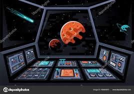
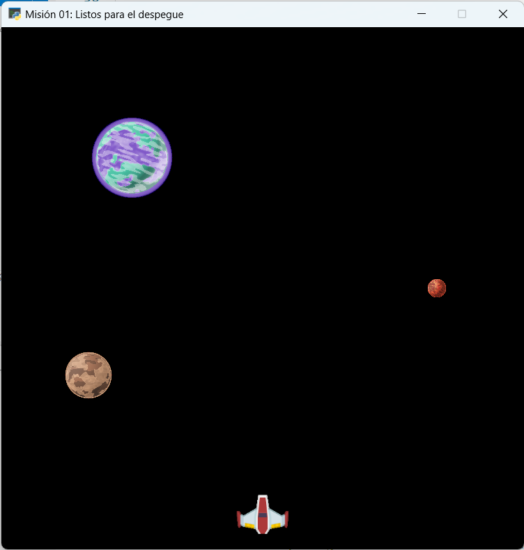
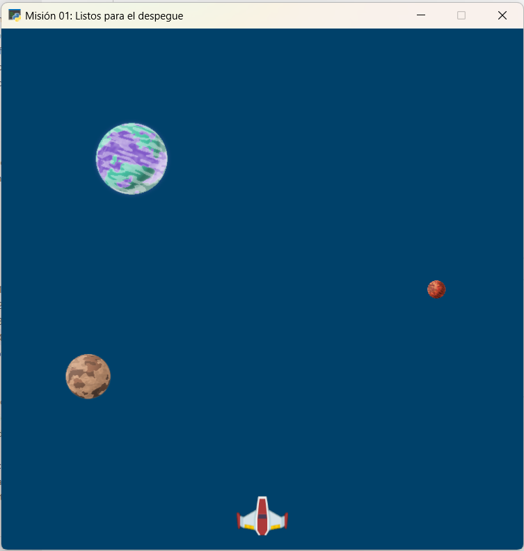
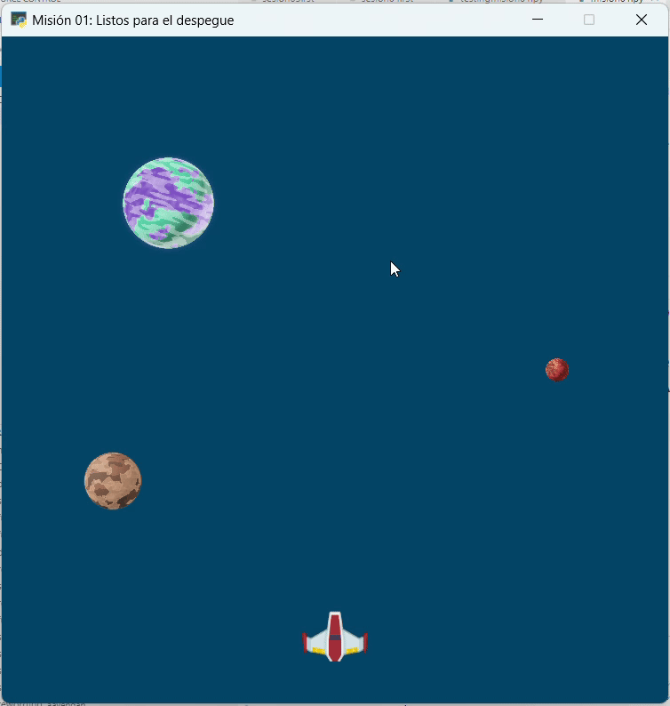

Misión 05: Navegando por el espacio 🚀🌌
===================================

En la misión anterior aprendimos a crear y a usar funciones propias. En esta sesión, aprenderemos a configurar panel de control de nuestra nave.

Para comenzar, abra **Visual Studio Code** y utiliza la carpeta ``galaxia_indie``. Verifica el archivo ``mision01.py`` tenga el siguiente código:

.. code-block:: python

    """
    Galaxia Indie

    Un juego indie minimalista de exploración espacial
    donde viajarás a través del cosmos.
    Navega a través de misteriosos sistemas estelares,
    descubriendo antiguos artefactos y desentrañando los
    misterios de una civilización olvidada.

    Creado con Python y con Arcade.
    """

    # Importar la librería "arcade" para crear videojuegos.
    import arcade

    # Constantes
    ALTO = 600
    ANCHO = 600
    TITULO = "Misión 01: Listos para el despegue"

    # Variables
    # Creamos una lista de sprites
    planetas = arcade.SpriteList()
    naves = arcade.SpriteList()

    # Creamos un sprite y establecemos la posición
    planeta1 = arcade.Sprite("sprites/planeta01.png", 0.08)
    planeta1.center_x = 150
    planeta1.center_y = 450

    # Agregamos el sprite a la lista de sprites
    planetas.append(planeta1)

    # Sprite 2
    planeta2 = arcade.Sprite("sprites/planeta02.png", 0.02)
    planeta2.center_x = ANCHO - 100
    planeta2.center_y = ALTO / 2
    planetas.append(planeta2)

    # Sprite 3
    planeta3 = arcade.Sprite("sprites/planeta03.png", 0.05)
    planeta3.center_x = 100
    planeta3.center_y = ALTO / 3
    planetas.append(planeta3)

    # Sprite 4
    nave01 = arcade.Sprite("sprites/nave01.png", 0.6)
    nave01.center_x = ANCHO / 2
    nave01.center_y = 40
    naves.append(nave01)

    #Funciones
    def abrir_ventana():
        """ Abre la ventana """
        
        # Crear una ventana de 600x600 píxeles con el título "Misión 01: Listos para el despegue"
        arcade.open_window(ANCHO, ALTO, TITULO)

    def fondo_ventana():  
        """ Muestra el fondo de la ventana """
        
        # Establecer el color de fondo de la ventana
        arcade.set_background_color( arcade.color.DARK_IMPERIAL_BLUE )

    abrir_ventana()
    fondo_ventana()

    # Inicio del dibujo
    arcade.start_render()

    # (Aquí irá el código para dibujar)
    planetas.draw()
    naves.draw()

    # Fin del dibujo
    arcade.finish_render()

    # Inicia el bucle principal del juego que mantiene la ventana abierta
    arcade.run()

Control: Dibujar todos los sprites
------------------

El primer control a programar será **dibujar todos los sprites**. Para esto: 

#. Defina la función :py:func:`dibujar_sprites()`,
#. Mueva las instrucciones para dibujar las listas de *sprites*.
#. Llame a la función :py:func:`dibujar_sprites()` en el lugar donde se encontraban las instrucciones para dibujar las listas de *sprites*

.. code-block:: python
    :caption: Define la función dibujar_sprites
    :emphasize-lines: 5-9, 15-16

    ...
    def fondo_ventana():
        ...
   
    def dibujar_sprites():
        """ Limpia la pantalla y dibuja la lista de sprites """
        
        planetas.draw()
        naves.draw()

    ...

    # (Aquí irá el código para dibujar)
    
    # El control on_draw sirve para indicar qué función se ejecutará cada vez que se necesite redibujar la ventana del juego
    arcade.get_window().on_draw = dibujar_sprites

    # Fin del dibujo
    ...

Al ejecutar el código, deberías ver los tres planetas y la nave en la ventana como 
se muestra a continuación.

Para resolver el problema del fondo negro, será necesario **limpiar la pantalla** con ``.

.. code-block:: python
    :caption: Define la función dibujar_sprites
    :emphasize-lines: 5-6

    ...
    def dibujar_sprites():
        """ Limpia la pantalla y dibuja la lista de sprites """

        # Limpia la ventana antes de dibujar
        arcade.get_window().clear()

        planetas.draw()
        naves.draw()

Al ejecutar el código, deberías ver los tres planetas y la nave en la ventana como 
se muestra a continuación.

El control :py:func:`arcade.get_window().on_draw` sirve para indicar qué función se ejecutará cada vez que se necesite redibujar la ventana del juego.

Control: Mover la nave
------------------

El segundo control a programar será **mover la nave**. Para esto: 

.. code-block:: python
    :caption: Define la función dibujar_sprites
    :emphasize-lines: 3, 9-13, 20-21

    # Constantes
    ...
    ESPACIO = 10

    ...
    def dibujar_sprites():
        ...

    def mover_sprites(tecla_principal, tecla_modificadora):
        """ Reacciona a la tecla presionada (tecla_principal) con el movimiento de la nave"""

        if tecla_principal == arcade.key.UP:
            nave01.center_y = nave01.center_y + ESPACIO
    
    ...

    # El control on_draw sirve para indicar qué función se ejecutará cada vez que se necesite redibujar la ventana del juego
    ...

    # El control on_key_press sirve para indicar qué función se ejecutará cuando se presione una tecla en el juego.
    arcade.get_window().on_key_press = mover_sprites
    
    # Fin del dibujo
    ...

Al ejecutar el código, presiona la tecla **flecha arriba ↑** y la nave se moverá hacia arriba.

El control :py:func:`arcade.get_window().on_key_press` sirve para indicar qué función se ejecutará cuando se presione una tecla en el juego.

.. rubric:: Explicación
  :heading-level: 2
  :class: explanation

La instrucción `if` contiene una :term:`condición` seguida de dos puntos (`:`). La condición se lee `si la tecla_principal es igual a arcade.key.UP (la tecla flecha arriba ↑)`. En caso que la condición sea verdadera se ejecutará la instrucción indentada.

.. code-block:: python
    :emphasize-lines: 2

    ...
    if tecla_principal == arcade.key.UP:
        nave01.center_y = nave01.center_y + ESPACIO

La instrucción indentada `nave01.center_y = nave01.center_y + ESPACIO` aumentará la posición en **y**, es decir se moverá hacia arriba.

.. code-block:: python
    :emphasize-lines: 3

    ...
    if tecla_principal == arcade.key.UP:
        nave01.center_y = nave01.center_y + ESPACIO

.. rubric:: Reto
  :heading-level: 2
  :class: mi-clase-css

Dentro de la función :py:func:`dibujar_sprites()`:

#. Agrega otra instrucción `if`
#. La condición es `si la tecla_principal es igual a arcade.key.DOWN (la tecla flecha abajo ↓)`
#. Si la condición es verdadera, la posición en **y** reducirá, es decir se moverá hacia arriba.

Al ejecutar el código, presiona la tecla **flecha arriba ↑** y la nave se moverá hacia arriba. Mientras que si presiona la tecla **flecha abajo ↓** y la nave se moverá hacia abajo.

.. figure:: ../img/sesion05/tresplanetasynavemoviendoupdown.gif
    :width: 300
    :figclass: align-center
    :alt: tresplanetasynavemoviendoupdown

.. admonition:: Haga click aquí para ver la solución
  :collapsible: closed

  .. code-block:: python
    :emphasize-lines: 8-9

    ...

    def mover_sprites(tecla_principal, tecla_modificadora):
    """ Reacciona a la tecla presionada (tecla_principal) con el movimiento de la nave"""

        ...

        if tecla_principal == arcade.key.DOWN:
            nave01.center_y = nave01.center_y - ESPACIO

.. rubric:: Reto
  :heading-level: 2
  :class: mi-clase-css

Dentro de la función :py:func:`dibujar_sprites()`:

#. Agrega una instrucción `if`
#. La condición es `si la tecla_principal es igual a arcade.key.LEFT (la tecla flecha izquierda ←)`.
#. Si la condición es verdadera, la posición en **x** reducirá, es decir se moverá hacia izquierda.
#. Agrega una instrucción `if`
#. La condición es `si la tecla_principal es igual a arcade.key.RIGHT (la tecla flecha derecha →)`.
#. Si la condición es verdadera, la posición en **x** aumentará, es decir se moverá hacia derecha.

.. admonition:: Haga click aquí para ver la solución
  :collapsible: closed

  .. code-block:: python
    :emphasize-lines: 8-9,11-12

    ...

    def mover_sprites(tecla_principal, tecla_modificadora):
    """ Reacciona a la tecla presionada (tecla_principal) con el movimiento de la nave"""

        ...

        if tecla_principal == arcade.key.LEFT:
            nave01.center_x = nave01.center_x - ESPACIO
       
        if tecla_principal == arcade.key.RIGHT:
            nave01.center_x = nave01.center_x + ESPACIO

.. rubric:: Reto
  :heading-level: 2
  :class: mi-clase-css

Dentro de la función :py:func:`dibujar_sprites()`:

#. Agrega una instrucción `if`
#. La condición es `si la tecla_principal es igual a arcade.key.F (la tecla F)`.
#. Si la condición es verdadera, el ángulo reducirá, es decir girará hacia la derecha en su misma posición.
#. Agrega una instrucción `if`
#. La condición es `si la tecla_principal es igual a arcade.key.S (la tecla S)`.
#. Si la condición es verdadera, el ángulo aumentará, es decir girará hacia la izquierda en su misma posición.

.. admonition:: Haga click aquí para ver la solución
  :collapsible: closed

  .. code-block:: python
    :emphasize-lines: 8-9,11-12

    ...

    def mover_sprites(tecla_principal, tecla_modificadora):
    """ Reacciona a la tecla presionada (tecla_principal) con el movimiento de la nave"""

        ...

        if tecla_principal == arcade.key.F:
            nave01.angle = nave01.angle + ESPACIO
        if tecla_principal == arcade.key.S:
            nave01.angle = nave01.angle - ESPACIO