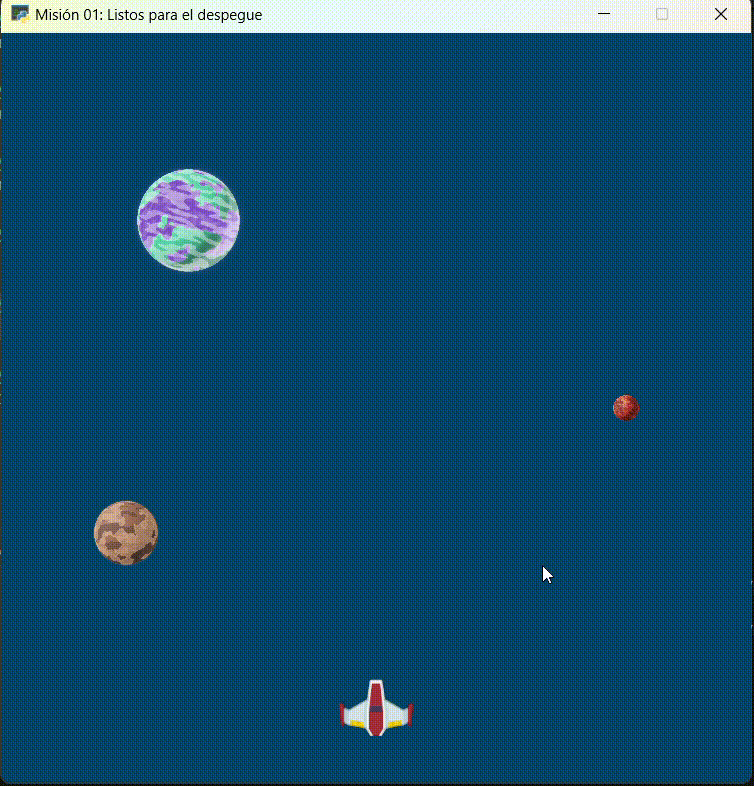
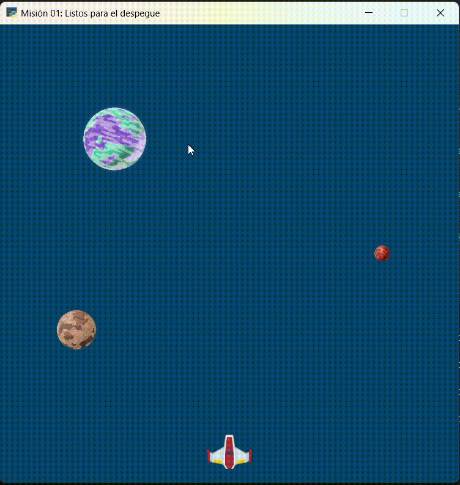
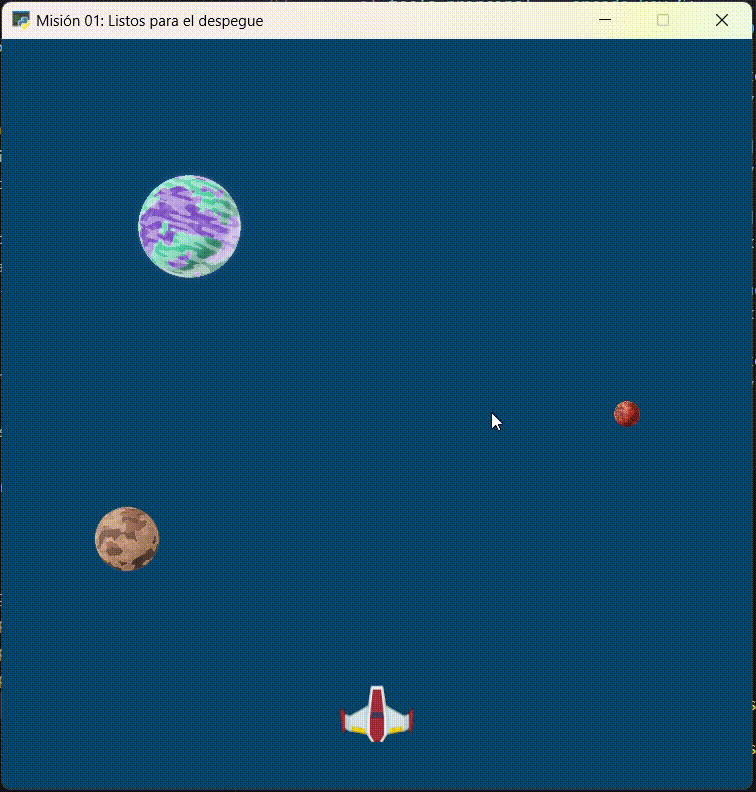
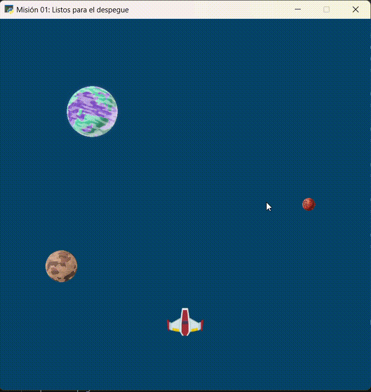

Misión 06: A la velocidad de la luz 🚀
===================================

En la misión anterior aprendimos a configurar panel de control de nuestra nave. En esta sesión, aprenderemos acelerar o desacelerar la nave.

Para comenzar, abra **Visual Studio Code** y utiliza la carpeta ``galaxia_indie``. Verifica el archivo ``mision01.py`` tenga el siguiente código:

.. code-block:: python

    """
    Galaxia Indie

    Un juego indie minimalista de exploración espacial
    donde viajarás a través del cosmos.
    Navega a través de misteriosos sistemas estelares,
    descubriendo antiguos artefactos y desentrañando los
    misterios de una civilización olvidada.

    Creado con Python y con Arcade.
    """

    # Importar la librería "arcade" para crear videojuegos.
    import arcade

    # Constantes
    ALTO = 600
    ANCHO = 600
    TITULO = "Misión 01: Listos para el despegue"
    ESPACIO = 10

    # Variables
    # Creamos una lista de sprites
    planetas = arcade.SpriteList()
    naves = arcade.SpriteList()

    # Creamos un sprite y establecemos la posición
    planeta1 = arcade.Sprite("sprites/planeta01.png", 0.08)
    planeta1.center_x = 150
    planeta1.center_y = 450

    # Agregamos el sprite a la lista de sprites
    planetas.append(planeta1)

    # Sprite 2
    planeta2 = arcade.Sprite("sprites/planeta02.png", 0.02)
    planeta2.center_x = ANCHO - 100
    planeta2.center_y = ALTO / 2
    planetas.append(planeta2)

    # Sprite 3
    planeta3 = arcade.Sprite("sprites/planeta03.png", 0.05)
    planeta3.center_x = 100
    planeta3.center_y = ALTO / 3
    planetas.append(planeta3)

    # Sprite 4
    nave01 = arcade.Sprite("sprites/nave01.png", 0.6)
    nave01.center_x = ANCHO / 2
    nave01.center_y = 40
    naves.append(nave01)

    #Funciones
    def abrir_ventana():
        """ Abre la ventana """

        # Crear una ventana de 600x600 píxeles con el título "Misión 01: Listos para el despegue"
        arcade.open_window(ANCHO, ALTO, TITULO)

    def fondo_ventana():
        """ Muestra el fondo de la ventana """

        # Establecer el color de fondo de la ventana
        arcade.set_background_color( arcade.color.DARK_IMPERIAL_BLUE )

    def dibujar_sprites():
        """ Limpia la pantalla y dibuja la lista de sprites """

        # Limpia la ventana antes de dibujar
        arcade.get_window().clear()

        planetas.draw()
        naves.draw()
        
    def mover_sprites(tecla_principal, tecla_modificadora):
        """ Reacciona a la tecla presionada (tecla_principal) con el movimiento de la nave"""

        if tecla_principal == arcade.key.UP:
            nave01.center_y = nave01.center_y + ESPACIO
            
        if tecla_principal == arcade.key.DOWN:
            nave01.center_y = nave01.center_y - ESPACIO
            
        if tecla_principal == arcade.key.LEFT:
            nave01.center_x = nave01.center_x - ESPACIO

        if tecla_principal == arcade.key.RIGHT:
            nave01.center_x = nave01.center_x + ESPACIO
            
        if tecla_principal == arcade.key.F:
            nave01.angle = nave01.angle + ESPACIO
            
        if tecla_principal == arcade.key.S:
            nave01.angle = nave01.angle - ESPACIO

    abrir_ventana()
    fondo_ventana()

    # Inicio del dibujo
    arcade.start_render()

    # (Aquí irá el código para dibujar)

    # El control on_draw sirve para indicar qué función se ejecutará cada vez que se necesite redibujar la ventana del juego
    arcade.get_window().on_draw = dibujar_sprites

    # El control on_key_press sirve para indicar qué función se ejecutará cuando se presione una tecla en el juego.
    arcade.get_window().on_key_press = mover_sprites

    # Fin del dibujo
    arcade.finish_render()

    # Inicia el bucle principal del juego que mantiene la ventana abierta
    arcade.run()

Control: Mover la nave (Aceleración)
------------------

Para acelerar el movimiento de la nave será necesario que nuestro control **mover la nave** considere una nueva combinación de teclas, por ejemplo: **flecha arriba ↑** + **tecla modificadora control MOD_CTRL**. 

.. code-block:: python
    :caption: Define la función dibujar_sprites
    :emphasize-lines: 11-12

    ...
    
    def mover_sprites(tecla_principal, tecla_modificadora):
        """ Reacciona a la tecla presionada (tecla_principal) con el movimiento de la nave"""

        ... 

        if tecla_principal == arcade.key.S:
            ...

        if tecla_principal == arcade.key.UP and tecla_modificadora & arcade.key.MOD_CTRL:
            nave01.center_y = nave01.center_y + (ESPACIO * 4)
    
    ...

Al ejecutar el código, presiona la combinación de teclas **flecha arriba ↑** + **tecla modificadora control MOD_CTRL** y la nave se moverá más rápido hacia arriba.

.. rubric:: Reto
  :heading-level: 2
  :class: mi-clase-css

Dentro de la función :py:func:`dibujar_sprites()`:

#. Considere la tecla modificadora **MOD_CTRL** y las teclas principales de movimiento. 
#. Agregue la instrucción para realizar el movimiento acelerado en la dirección.

Al ejecutar el código, presiona las teclas y sus modificadores para tener el siguiente movimiento de la nave.

Control: Mover la nave (Desaceleración)
------------------

Para desacelerar el movimiento de la nave será necesario que nuestro control **mover la nave** considere una nueva combinación de teclas, por ejemplo: **flecha arriba ↑** + **tecla modificadora shift MOD_SHIFT**. 

.. code-block:: python
    :caption: Define la función dibujar_sprites
    :emphasize-lines: 11-12

    ...
    
    def mover_sprites(tecla_principal, tecla_modificadora):
        """ Reacciona a la tecla presionada (tecla_principal) con el movimiento de la nave"""

        ... 

        if tecla_principal == arcade.key.RIGHT and tecla_modificadora & arcade.key.MOD_CTRL:
            ...

        if tecla_principal == arcade.key.UP and tecla_modificadora & arcade.key.MOD_SHIFT:
            nave01.center_y = nave01.center_y + (ESPACIO / 10)
    
    ...

Al ejecutar el código, presiona la combinación de teclas **flecha arriba ↑** + **tecla modificadora shift MOD_SHIFT** y la nave se moverá más lento hacia arriba.

.. rubric:: Reto
  :heading-level: 2
  :class: mi-clase-css

Dentro de la función :py:func:`dibujar_sprites()`:

#. Considere la tecla modificadora **MOD_SHIFT** y las teclas principales de movimiento. 
#. Agregue la instrucción para realizar el movimiento desacelerado en la dirección.

Al ejecutar el código, presiona las teclas y sus modificadores para tener el siguiente movimiento de la nave.

.. note::
    
    Puedes obtener más teclas modificadores en `arcade.key package <https://api.arcade.academy/en/2.6.1/arcade.key.html>`_.

.. rubric:: En resumen
  :heading-level: 2

Al finalizar esta sesión, tu código debería verse así:

.. code-block:: python

    """
    Galaxia Indie

    Un juego indie minimalista de exploración espacial
    donde viajarás a través del cosmos.
    Navega a través de misteriosos sistemas estelares,
    descubriendo antiguos artefactos y desentrañando los
    misterios de una civilización olvidada.

    Creado con Python y con Arcade.
    """

    # Importar la librería "arcade" para crear videojuegos.
    import arcade

    # Constantes
    ALTO = 600
    ANCHO = 600
    TITULO = "Misión 01: Listos para el despegue"
    ESPACIO = 10

    # Variables
    # Creamos una lista de sprites
    planetas = arcade.SpriteList()
    naves = arcade.SpriteList()

    # Creamos un sprite y establecemos la posición
    planeta1 = arcade.Sprite("sprites/planeta01.png", 0.08)
    planeta1.center_x = 150
    planeta1.center_y = 450

    # Agregamos el sprite a la lista de sprites
    planetas.append(planeta1)

    # Sprite 2
    planeta2 = arcade.Sprite("sprites/planeta02.png", 0.02)
    planeta2.center_x = ANCHO - 100
    planeta2.center_y = ALTO / 2
    planetas.append(planeta2)

    # Sprite 3
    planeta3 = arcade.Sprite("sprites/planeta03.png", 0.05)
    planeta3.center_x = 100
    planeta3.center_y = ALTO / 3
    planetas.append(planeta3)

    # Sprite 4
    nave01 = arcade.Sprite("sprites/nave01.png", 0.6)
    nave01.center_x = ANCHO / 2
    nave01.center_y = 40
    naves.append(nave01)

    #Funciones
    def abrir_ventana():
        """ Abre la ventana """

        # Crear una ventana de 600x600 píxeles con el título "Misión 01: Listos para el despegue"
        arcade.open_window(ANCHO, ALTO, TITULO)

    def fondo_ventana():
        """ Muestra el fondo de la ventana """

        # Establecer el color de fondo de la ventana
        arcade.set_background_color( arcade.color.DARK_IMPERIAL_BLUE )

    def dibujar_sprites():
        """ Limpia la pantalla y dibuja la lista de sprites """

        # Limpia la ventana antes de dibujar
        arcade.get_window().clear()

        planetas.draw()
        naves.draw()

    def mover_sprites(tecla_principal, tecla_modificadora):
        """ Reacciona a la tecla presionada (tecla_principal) con el movimiento de la nave"""

        if tecla_principal == arcade.key.UP:
            nave01.center_y = nave01.center_y + ESPACIO

        if tecla_principal == arcade.key.DOWN:
            nave01.center_y = nave01.center_y - ESPACIO

        if tecla_principal == arcade.key.LEFT:
            nave01.center_x = nave01.center_x - ESPACIO

        if tecla_principal == arcade.key.RIGHT:
            nave01.center_x = nave01.center_x + ESPACIO

        if tecla_principal == arcade.key.F:
            nave01.angle = nave01.angle + ESPACIO

        if tecla_principal == arcade.key.S:
            nave01.angle = nave01.angle - ESPACIO

        if tecla_principal == arcade.key.UP and tecla_modificadora & arcade.key.MOD_CTRL:
            nave01.center_y = nave01.center_y + (ESPACIO * 4)

        # Aquí van los otros controles de movimiento con aceleración
        
        if tecla_principal == arcade.key.UP and tecla_modificadora & arcade.key.MOD_SHIFT:
            nave01.center_y = nave01.center_y + (ESPACIO / 10)

        # Aquí van los otros controles de movimiento con desaceleración

        
    abrir_ventana()
    fondo_ventana()

    # Inicio del dibujo
    arcade.start_render()

    # (Aquí irá el código para dibujar)

    # El control on_draw sirve para indicar qué función se ejecutará cada vez que se necesite redibujar la ventana del juego
    arcade.get_window().on_draw = dibujar_sprites

    # El control on_key_press sirve para indicar qué función se ejecutará cuando se presione una tecla en el juego.
    arcade.get_window().on_key_press = mover_sprites

    # Fin del dibujo
    arcade.finish_render()

    # Inicia el bucle principal del juego que mantiene la ventana abierta
    arcade.run()