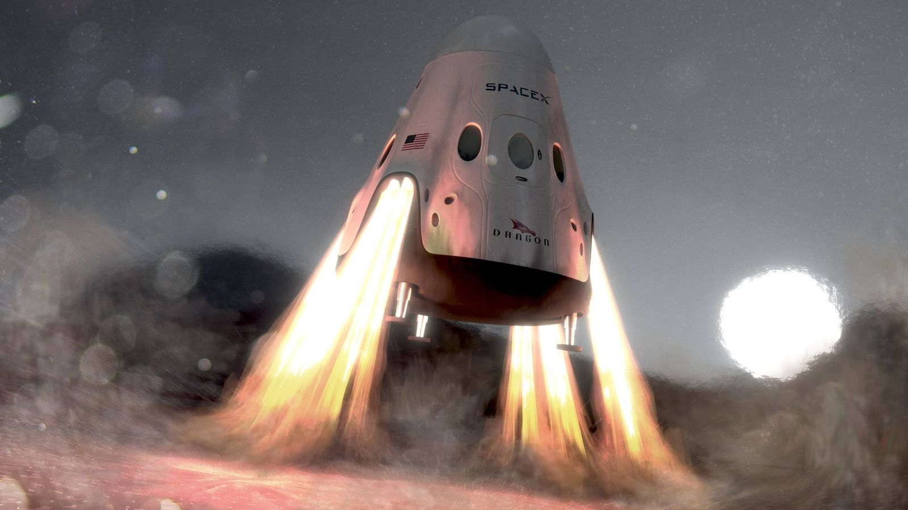
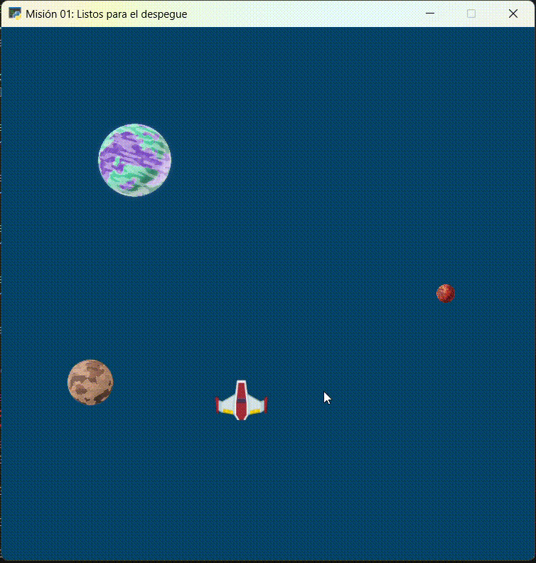
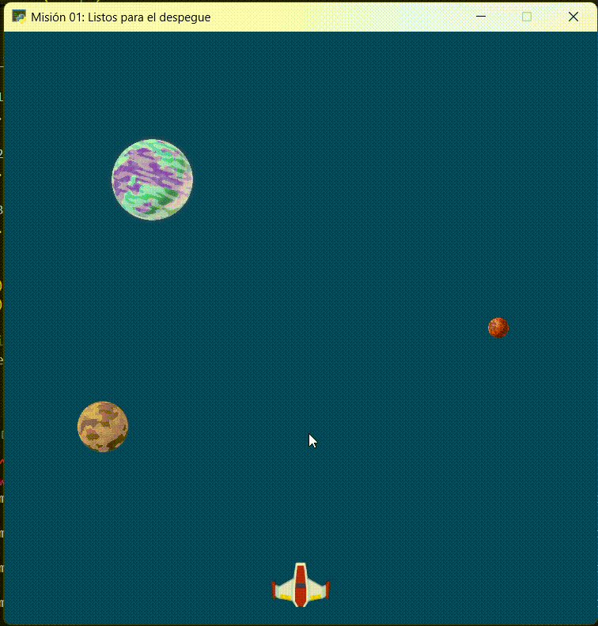

Misión 07: Explorando planetas 🚀🌑
===================================

En la misión anterior aprendimos a acelerar y desacelerar nuestra nave. En esta sesión, aprenderemos a verifica si la nave se encuentra explorando un planeta.

Para comenzar, abra **Visual Studio Code** y utiliza la carpeta ``galaxia_indie``. Verifica el archivo ``mision01.py`` tenga el siguiente código:

.. code-block:: python

    """
    Galaxia Indie

    Un juego indie minimalista de exploración espacial
    donde viajarás a través del cosmos.
    Navega a través de misteriosos sistemas estelares,
    descubriendo antiguos artefactos y desentrañando los
    misterios de una civilización olvidada.

    Creado con Python y con Arcade.
    """

    # Importar la librería "arcade" para crear videojuegos.
    import arcade

    # Constantes
    ALTO = 600
    ANCHO = 600
    TITULO = "Misión 01: Listos para el despegue"
    ESPACIO = 10

    # Variables
    # Creamos una lista de sprites
    planetas = arcade.SpriteList()
    naves = arcade.SpriteList()

    # Creamos un sprite y establecemos la posición
    planeta1 = arcade.Sprite("sprites/planeta01.png", 0.08)
    planeta1.center_x = 150
    planeta1.center_y = 450

    # Agregamos el sprite a la lista de sprites
    planetas.append(planeta1)

    # Sprite 2
    planeta2 = arcade.Sprite("sprites/planeta02.png", 0.02)
    planeta2.center_x = ANCHO - 100
    planeta2.center_y = ALTO / 2
    planetas.append(planeta2)

    # Sprite 3
    planeta3 = arcade.Sprite("sprites/planeta03.png", 0.05)
    planeta3.center_x = 100
    planeta3.center_y = ALTO / 3
    planetas.append(planeta3)

    # Sprite 4
    nave01 = arcade.Sprite("sprites/nave01.png", 0.6)
    nave01.center_x = ANCHO / 2
    nave01.center_y = 40
    naves.append(nave01)

    #Funciones
    def abrir_ventana():
        """ Abre la ventana """

        # Crear una ventana de 600x600 píxeles con el título "Misión 01: Listos para el despegue"
        arcade.open_window(ANCHO, ALTO, TITULO)

    def fondo_ventana():
        """ Muestra el fondo de la ventana """

        # Establecer el color de fondo de la ventana
        arcade.set_background_color( arcade.color.DARK_IMPERIAL_BLUE )

    def dibujar_sprites():
        """ Limpia la pantalla y dibuja la lista de sprites """

        # Limpia la ventana antes de dibujar
        arcade.get_window().clear()

        planetas.draw()
        naves.draw()

    def mover_sprites(tecla_principal, tecla_modificadora):
        """ Reacciona a la tecla presionada (tecla_principal) con el movimiento de la nave"""

        if tecla_principal == arcade.key.UP:
            nave01.center_y = nave01.center_y + ESPACIO

        if tecla_principal == arcade.key.DOWN:
            nave01.center_y = nave01.center_y - ESPACIO

        if tecla_principal == arcade.key.LEFT:
            nave01.center_x = nave01.center_x - ESPACIO

        if tecla_principal == arcade.key.RIGHT:
            nave01.center_x = nave01.center_x + ESPACIO

        if tecla_principal == arcade.key.F:
            nave01.angle = nave01.angle + ESPACIO

        if tecla_principal == arcade.key.S:
            nave01.angle = nave01.angle - ESPACIO

        # Controles de movimiento con aceleración
        if tecla_principal == arcade.key.UP and tecla_modificadora & arcade.key.MOD_CTRL:
            nave01.center_y = nave01.center_y + (ESPACIO * 4)

        if tecla_principal == arcade.key.DOWN and tecla_modificadora & arcade.key.MOD_CTRL:
                nave01.center_y = nave01.center_y - (ESPACIO * 4)

        if tecla_principal == arcade.key.LEFT and tecla_modificadora & arcade.key.MOD_CTRL:
                nave01.center_x = nave01.center_x - (ESPACIO * 4)

        if tecla_principal == arcade.key.RIGHT and tecla_modificadora & arcade.key.MOD_CTRL:
                nave01.center_x = nave01.center_x + (ESPACIO * 4)

        # Controles de movimiento con desaceleración
        if tecla_principal == arcade.key.UP and tecla_modificadora & arcade.key.MOD_SHIFT:
                nave01.center_y = nave01.center_y + (ESPACIO / 10)

        if tecla_principal == arcade.key.DOWN and tecla_modificadora & arcade.key.MOD_SHIFT:
                nave01.center_y = nave01.center_y - (ESPACIO / 10)

        if tecla_principal == arcade.key.LEFT and tecla_modificadora & arcade.key.MOD_SHIFT:
                nave01.center_x = nave01.center_x - (ESPACIO / 10)

        if tecla_principal == arcade.key.RIGHT and tecla_modificadora & arcade.key.MOD_SHIFT:
                nave01.center_x = nave01.center_x + (ESPACIO / 10)

    abrir_ventana()
    fondo_ventana()

    # Inicio del dibujo
    arcade.start_render()

    # (Aquí irá el código para dibujar)

    # El control on_draw sirve para indicar qué función se ejecutará cada vez que se necesite redibujar la ventana del juego
    arcade.get_window().on_draw = dibujar_sprites

    # El control on_key_press sirve para indicar qué función se ejecutará cuando se presione una tecla en el juego.
    arcade.get_window().on_key_press = mover_sprites

    # Fin del dibujo
    arcade.finish_render()

    # Inicia el bucle principal del juego que mantiene la ventana abierta
    arcade.run()

Control: Verificar aterrizaje
------------------

El siguiente control a programar será **verificar aterrizaje**. Para esto: 

#. Defina la función :py:func:`verificar_aterrizaje()`,
#. Agregue control :py:func:`arcade.get_window().on_update` sirve para indicar qué función se ejecutará cuando ocurra una actualización entre los sprites en el juego.

.. code-block:: python
    :caption: Define la función verificar_aterrizaje
    :emphasize-lines: 6-14, 20-21

    ...

    def mover_sprites():
        ...
   
    def verificar_aterrizaje(tiempo):
        """ Detecta si ocurre una actualización entre los sprites """

        aterrizaje = arcade.check_for_collision_with_list( nave01, planetas )

        arcade.get_window().on_message = ""

        if planeta1 in aterrizaje:
            arcade.get_window().on_message = "¡A explorar el Planeta01!"
    ...

    # El control on_key_press sirve para indicar qué función se ejecutará cuando se presione una tecla en el juego.
    ...

    # El control on_update sirve para indicar qué función se ejecutará cuando ocurra una actualización entre los sprites del juego.
    arcade.get_window().on_update = verificar_aterrizaje

    # Fin del dibujo
    ...

.. rubric:: Explicación
  :heading-level: 2
  :class: explanation

La instrucción `aterrizaje = arcade.check_for_collision_with_list( nave01, planetas )` verifica si hay alguna actualización entre la `nave01` y los `planetas`.

.. code-block:: python
    :emphasize-lines: 2

        ...
        aterrizaje = arcade.check_for_collision_with_list( nave01, planetas )

Con la instrucción `if planeta1 in aterrizaje:` verificamos si existe `planeta1` está dentro del `aterrizaje`. De ser verdad, guardará un mensaje en la ventana `arcade.get_window().on_message = "¡A explorar el Planeta01!"` 

.. code-block:: python
    :emphasize-lines: 3-4

        ...

        if planeta1 in aterrizaje:
            arcade.get_window().on_message = "¡A explorar el Planeta01!"

¡A explorar!
------------------

Ahora, será cuestión de mostrar el mensaje que está guardado en la ventana.

#. Guarda el mensaje de la ventana, con `mensaje = arcade.get_window().on_message`
#. Muestra un texto en la ventana con el mensaje, con: `arcade.Text(mensaje, 150, 100, arcade.color.WHEAT, 20).draw()`

.. code-block:: python
    :caption: Define la función verificar_aterrizaje
    :emphasize-lines: 12-14

    ...

    def dibujar_sprites():
        """ Limpia la pantalla y dibuja la lista de sprites """

        # Limpia la ventana antes de dibujar
        arcade.get_window().clear()

        planetas.draw()
        naves.draw()

        # Mensaje en (150, 100), de tamaño 20 pts.
        mensaje = arcade.get_window().on_message
        arcade.Text(mensaje, 150, 100, arcade.color.WHEAT, 20).draw()

    ...

Al ejecutar el código, mueva la nave hasta alcanzar el **Planeta01**.

.. rubric:: Reto
  :heading-level: 2
  :class: mi-clase-css

Dentro de la función :py:func:`verificar_aterrizaje()`:

#. Agregue la verificación si la nave aterrizó en el **Planeta02** y en el **Planeta03**.

Al ejecutar el código, presiona las teclas y sus modificadores para tener el siguiente movimiento de la nave.

