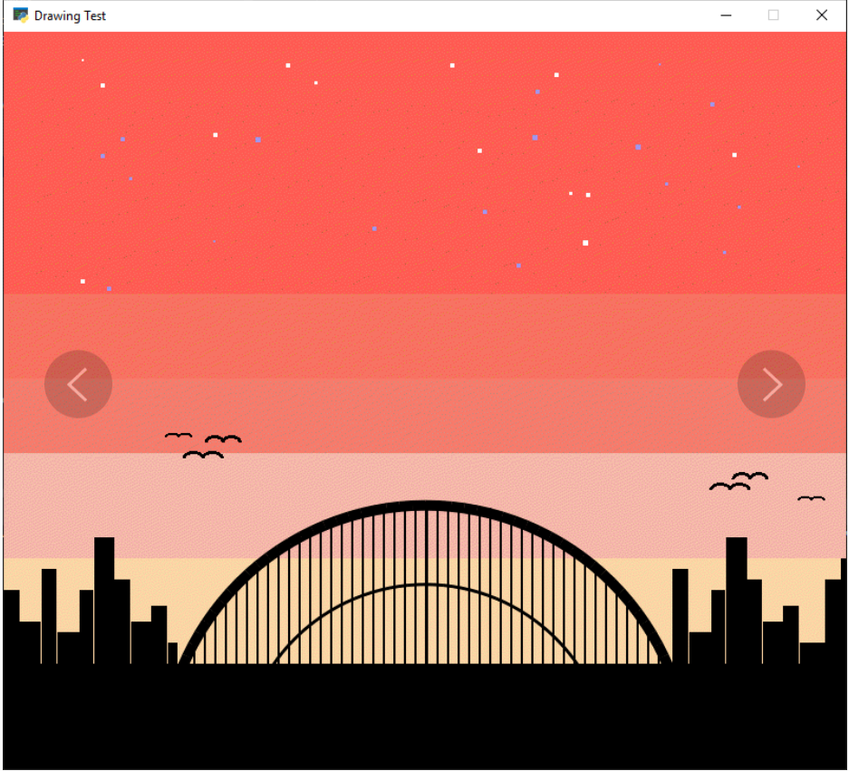

Taller 02
===================================

Para comenzar a desarrollar su videojuego en Python con Arcade, deben 
crear una pantalla de introducción que le dé la bienvenida al jugador y 
muestre el nombre del juego. 

En esta pantalla, utilicen líneas, circunferencias, rectángulos y otras 
formas geométricas para decorar y hacerla más atractiva. 

Pueden dibujar un marco alrededor de la pantalla, agregar un logo o 
símbolos relacionados con el juego, o crear un fondo con patrones geométricos. 
Además, incluyan un mensaje o título que indique el nombre del juego y una 
instrucción sencilla, como "Presiona una tecla para comenzar". 

Recuerden que esta es la primera impresión que tendrá el jugador, 
así que aprovechen para demostrar su creatividad.

Acá, dos ejemplos de pantallas de introducción para videojuegos:

