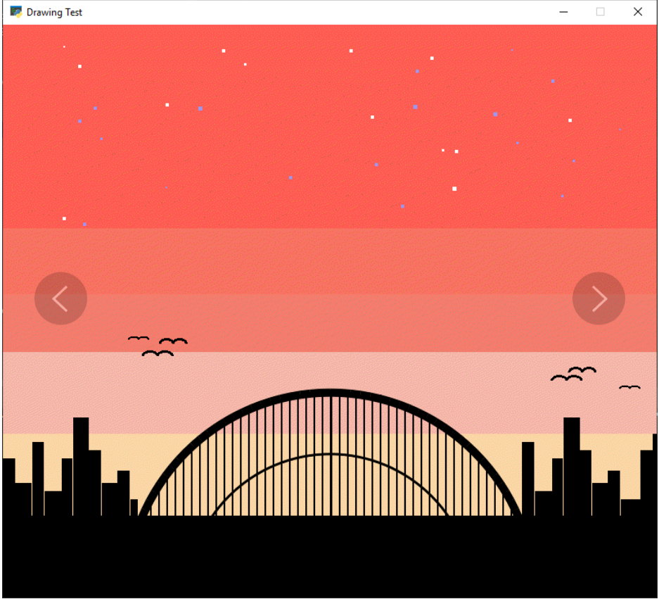

Taller 03
===================================

Reproduce la siguiente imagen mediante figuras primitivas de Arcade

Utiliza el siguente código como base para comenzar:

.. code-block:: python

      """
      Atardecer naranja de la ciudad

      Creado con Python y con Arcade.
      """

      # Importar la librería "arcade" para crear videojuegos.
      import arcade

      # Constantes
      ALTO = 600
      ANCHO = 600
      TITULO = "Atardecer naranja de la ciudad"

      # Crear una ventana de 600x600 píxeles con el título "Atardecer naranja de la ciudad"
      arcade.open_window(ANCHO, ALTO, TITULO)    

      # Establecer el color de fondo de la ventana
      arcade.set_background_color( arcade.csscolor.ORANGE_RED )

      # Inicio del dibujo
      arcade.start_render()

      # (Aquí irá el código para dibujar)

      # Fin del dibujo
      arcade.finish_render()

      # Inicia el bucle principal del juego que mantiene la ventana abierta
      arcade.run()

.. note::

    Puedes consultar los nombres en la 
    tabla de colores de 
    `arcade.csscolor <https://api.arcade.academy/en/latest/api_docs/arcade.csscolor.html>`_.
    para especificar colores por nombre (por 
    ejemplo `arcade.csscolor.DARK_VIOLET`) o  `arcade.color <https://api.arcade.academy/en/latest/api_docs/arcade.color.html>`_.
    para especificar colores por nombre (por 
    ejemplo `arcade.color.DARK_IMPERIAL_BLUE`)
